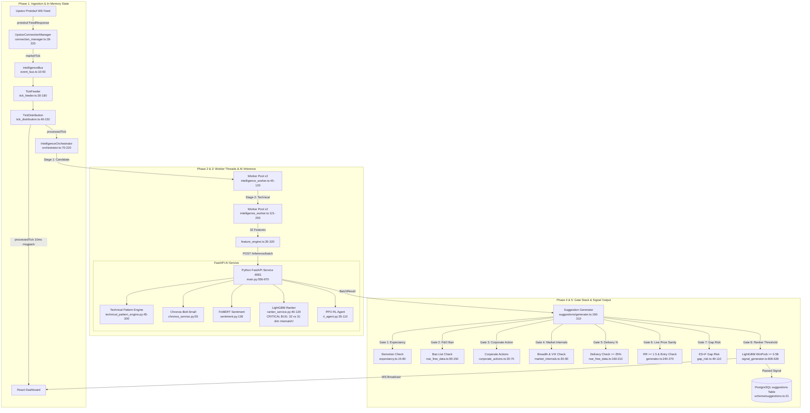

# ARCHITECTURE_ACTUAL.md — Forensic Architecture Audit of Mimir

> **Audit Context**: This document represents a forensic, code-first architectural audit of Mimir's data ingestion, feature engineering, model inference, signal synthesis, output consumption, and validation subsystems. Every claim is strictly backed by exact line-range citations to source code. Contradictions between official documentation (`README.md`, `/docs`, `mimir-confluence-engine.md`, `mimir-unified-strategy.md`, `prompt.txt`) and actual implementation are explicitly highlighted.

---

## 1. Executive Summary

- **CRITICAL BUG — Train/Serve Ranker Contract Mismatch (100% Ranker Rejection)**: 
  TypeScript serving in [`backend/src/analysis/feature_engine.ts:107-140`](file:///c:/Users/sahaj/Desktop/Mimir/backend/src/analysis/feature_engine.ts#L107-L140) defines `RANKER_FEATURE_KEYS` with **32 features** (ending with `fiiDiiNetFlowLag`), whereas Python ranker training in [`backend/ai_service/train_ranker.py:48-56`](file:///c:/Users/sahaj/Desktop/Mimir/backend/ai_service/train_ranker.py#L48-L56) defines `FEATURE_KEYS` with **31 features** (missing `fiiDiiNetFlowLag`). In live execution, [`backend/ai_service/models/ranker_service.py:158`](file:///c:/Users/sahaj/Desktop/Mimir/backend/ai_service/models/ranker_service.py#L158) checks `len(r) == expected` (`32 != 31`), rejecting **100% of live candidates** and forcing fallback rules on every single live signal.
- **Chronos Model Discrepancy**: `README.md:194` and `ai_service/main.py:4` claim `Chronos-Bolt-Tiny`, while `mimir-confluence-engine.md:7` claims `Chronos-T5`. The actual code in [`backend/ai_service/models/chronos_service.py:54-58`](file:///c:/Users/sahaj/Desktop/Mimir/backend/ai_service/models/chronos_service.py#L54-L58) explicitly loads `amazon/chronos-bolt-small` from HuggingFace.
- **LightGBM vs. XGBoost Ranker**: `prompt.txt:6` claims an "XGBoost learned ranker". The actual code in [`backend/ai_service/models/ranker_service.py:40-120`](file:///c:/Users/sahaj/Desktop/Mimir/backend/ai_service/models/ranker_service.py#40-L120) and [`backend/ai_service/train_ranker.py:170-310`](file:///c:/Users/sahaj/Desktop/Mimir/backend/ai_service/train_ranker.py#L170-L310) uses **LightGBM** (`ranker_model.txt`) with isotonic probability calibration, applying a hard gate at $P(\text{win}) < 0.58$ ([`backend/src/analysis/signal_generator.ts:606-626`](file:///c:/Users/sahaj/Desktop/Mimir/backend/src/analysis/signal_generator.ts#L606-L626)).
- **The "7-Stage Confluence Engine" Documentation Myth**: The 7-stage top-down funnel documented in [`mimir-confluence-engine.md:15-100`](file:///c:/Users/sahaj/Desktop/Mimir/mimir-confluence-engine.md#L15-L100) (Regime → Sector → RS → Structure → Order Flow → Catalyst → Risk) **does not exist** as an integrated engine in the codebase. Signal synthesis is instead executed across a 4-worker pipeline in [`backend/src/intelligence/orchestrator.ts:70-220`](file:///c:/Users/sahaj/Desktop/Mimir/backend/src/intelligence/orchestrator.ts#L70-L220) and an 11-gate filter stack in [`backend/src/suggestions/generator.ts:160-310`](file:///c:/Users/sahaj/Desktop/Mimir/backend/src/suggestions/generator.ts#L160-L310).
- **GIFT Nifty Ingestion is a Stub**: Documentation claims live GIFT Nifty gap risk tracking. In reality, [`backend/src/analysis/gap_risk.ts:127`](file:///c:/Users/sahaj/Desktop/Mimir/backend/src/analysis/gap_risk.ts#L127) explicitly hardcodes `snapshot.giftNiftyChangePct = null;`. Implied opening gap is estimated indirectly by scaling S&P 500 futures (`ES=F`) by Nifty's beta (0.6) ([`gap_risk.ts:130-132`](file:///c:/Users/sahaj/Desktop/Mimir/backend/src/analysis/gap_risk.ts#L130-L132)).
- **FinBERT Role**: FinBERT is **not** a blocking signal gate. It functions purely as an advisory input contributing ~5% to the composite AI score ([`backend/ai_service/main.py:520`](file:///c:/Users/sahaj/Desktop/Mimir/backend/ai_service/main.py#L520)). If FinBERT fails or transformers is uninstalled, it gracefully defaults to neutral (50/100) without blocking signal generation ([`backend/ai_service/sentiment.py:139`](file:///c:/Users/sahaj/Desktop/Mimir/backend/ai_service/sentiment.py#L139)).
- **Regime Detection Implementation**: [`mimir-unified-strategy.md:133`](file:///c:/Users/sahaj/Desktop/Mimir/mimir-unified-strategy.md#L133) claims an HMM statistical regime classifier runs alongside VIX on GPU. In reality, regime classification is **100% rule-based** across 7 states in [`backend/src/analysis/regime_detector.ts:40-390`](file:///c:/Users/sahaj/Desktop/Mimir/backend/src/analysis/regime_detector.ts#L40-L390) evaluating Nifty 50 SMA20/50, ADX(14), VIX thresholds, and FII/DII shifts. No HMM code exists in the repository.
- **Walk-Forward & SHAP Diagnostics**: Purged walk-forward validation with embargo gaps is fully implemented in [`walk_forward.py:11-72`](file:///c:/Users/sahaj/Desktop/Mimir/backend/ai_service/walk_forward.py#L11-L72) and [`walk_forward_harness.py:33-115`](file:///c:/Users/sahaj/Desktop/Mimir/backend/ai_service/walk_forward_harness.py#L33-L115). SHAP stability diagnostics and feature pruning are implemented in [`walk_forward_harness.py:225-311`](file:///c:/Users/sahaj/Desktop/Mimir/backend/ai_service/walk_forward_harness.py#L225-L311).
- **Intraday Tick-Path Bypasses Learned Ranker**: [`backend/src/analysis/intraday_monitor.ts:754`](file:///c:/Users/sahaj/Desktop/Mimir/backend/src/analysis/intraday_monitor.ts#L754) hardcodes `rankerIncomplete: true` for tick-derived feature vectors, setting `ranker_features: null` in [`signal_generator.ts:421`](file:///c:/Users/sahaj/Desktop/Mimir/backend/src/analysis/signal_generator.ts#L421). As a result, live tick-driven intraday signals **always bypass** the learned AI ranker.

---

## 2. Actual System Architecture Diagram

---

## 3. Detailed Phase Breakdown

### Phase 1 — Data Ingestion Layer
**Implementation Status**: `FULLY WIRED` (WebSocket & Polling Fallback)

#### 1. Connection Lifecycle & Backoff
- **Owner**: `UpstoxConnectionManager` in [`backend/src/intelligence/connection_manager.ts:18-552`](file:///c:/Users/sahaj/Desktop/Mimir/backend/src/intelligence/connection_manager.ts#L18-L552).
- **Authorization**: Fetches WebSocket URL via `https://api.upstox.com/v3/feed/market-data-feed/authorize` using `getAccessToken()` ([`connection_manager.ts:50-85`](file:///c:/Users/sahaj/Desktop/Mimir/backend/src/intelligence/connection_manager.ts#L50-L85)).
- **Protobuf Parsing**: Loads `MarketDataFeed.proto` ([`connection_manager.ts:42-76`](file:///c:/Users/sahaj/Desktop/Mimir/backend/src/intelligence/connection_manager.ts#L42-L76)) to decode binary WebSocket frames into `FeedResponse` protobuf objects.
- **Reconnect & Backoff**: Exponential backoff `2000 * 2^attempt` capped at 60s during market hours (09:15-15:30 IST Mon-Fri), capped at 300s off-hours ([`connection_manager.ts:418-464`](file:///c:/Users/sahaj/Desktop/Mimir/backend/src/intelligence/connection_manager.ts#L418-L464)). Circuit breaker trips after 5 consecutive failures for a 5-minute cooldown (`circuitBreakerCooldownMs = 300000`).
- **REST Fallback Poller**: Active when socket is disconnected or silent >30s ([`connection_manager.ts:480-534`](file:///c:/Users/sahaj/Desktop/Mimir/backend/src/intelligence/connection_manager.ts#L480-L534)), polling Upstox `/v3/market-quote/ltp` every 2 seconds.

#### 2. Raw vs. Derived Fields
- **Raw WS Fields**: `instrumentKey`, `ltp`, `volume`, `bid`, `ask`, `timestamp` ([`connection_manager.ts:313-359`](file:///c:/Users/sahaj/Desktop/Mimir/backend/src/intelligence/connection_manager.ts#L313-L359)).
- **Derived Fields**: `change` and `changePercent` relative to `prevClose` or `open`, daily `high` & `low` in `TickDistribution` ([`backend/src/market_data/tick_distribution.ts:203-214`](file:///c:/Users/sahaj/Desktop/Mimir/backend/src/market_data/tick_distribution.ts#L203-L214)). `tick_feeder.ts` flushes queued ticks to Redis (`upstox:ticks:${symbol}`) every 1 second.

#### 3. OHLCV Bar Construction & Timezone Bug
- **Candle Builder**: [`backend/src/intelligence/candle_builder.ts:12-91`](file:///c:/Users/sahaj/Desktop/Mimir/backend/src/intelligence/candle_builder.ts#L12-L91) constructs timeframes `1m`, `5m`, `15m`, `30m`, `1h`, `1d`.
- **Timezone Alignment Bug**: Line 45 `const startTime = Math.floor(tick.timestamp / duration) * duration;` uses raw UTC Epoch milliseconds. For `1d` (86,400,000 ms), 00:00 UTC corresponds to 05:30 IST, rather than 00:00 IST or 09:15 IST (NSE open), shifting daily candle boundaries.

#### 4. F&O Data, VIX, FII/DII, USDINR & GIFT Nifty
- **India VIX**: Polled every 5 mins during market hours via Yahoo Finance (`^INDIAVIX`) in [`backend/src/market_data/market_feed.ts:140-185`](file:///c:/Users/sahaj/Desktop/Mimir/backend/src/market_data/market_feed.ts#L140-L185).
- **PCR Calculation**: Scraped every 15 mins from NSE option chain in [`backend/src/market_data/option_chain.ts:68-149`](file:///c:/Users/sahaj/Desktop/Mimir/backend/src/market_data/option_chain.ts#L68-L149).
- **FII/DII Flow Data & Date Tagging Bug**: Scraped from NSE in [`backend/src/market_data/fii_dii.ts:57-149`](file:///c:/Users/sahaj/Desktop/Mimir/backend/src/market_data/fii_dii.ts#L57-L149). FII/DII summaries are published post-market (~18:00 IST). During live market hours, yesterday's post-market data is fetched and inserted into PostgreSQL with `date: todayStr` (`getISTDateStr()`), tagging yesterday's flows as TODAY'S date in the database.
- **USDINR**: Polled via Yahoo Finance (`INR=X`) with sanity band `[60, 120]` in [`backend/src/analysis/global_macro.ts:100-123`](file:///c:/Users/sahaj/Desktop/Mimir/backend/src/analysis/global_macro.ts#L100-L123).
- **GIFT Nifty Gap Data (Hardcoded Stub)**: [`backend/src/analysis/gap_risk.ts:127`](file:///c:/Users/sahaj/Desktop/Mimir/backend/src/analysis/gap_risk.ts#L127) explicitly hardcodes `snapshot.giftNiftyChangePct = null;`. Implied opening gap is estimated by scaling S&P 500 futures (`ES=F`) by Nifty's beta (0.6) ([`gap_risk.ts:130-132`](file:///c:/Users/sahaj/Desktop/Mimir/backend/src/analysis/gap_risk.ts#L130-L132)).

#### 5. Persistence & Sanity Validation
- **Redis Cache**: Hot tick state flushed to Redis every 1s (`upstox:ticks:${symbol}`, 24h TTL) ([`backend/src/lib/redis_state.ts:15-168`](file:///c:/Users/sahaj/Desktop/Mimir/backend/src/lib/redis_state.ts#L15-L168)).
- **PostgreSQL**: Candles persisted to `candles` table ([`backend/db/src/schema/candles.ts:1-25`](file:///c:/Users/sahaj/Desktop/Mimir/backend/db/src/schema/candles.ts#L1-L25)). Disk archiver flushes to `data/ticks/ticks_${todayIST}.jsonl` ([`tick_archiver.ts:19-58`](file:///c:/Users/sahaj/Desktop/Mimir/backend/src/market_data/tick_archiver.ts#L19-L58)).
- **Sanity Gates**: Ticks with `ltp <= 0` or timestamp drift >2000ms are dropped ([`tick_feeder.ts:128-133`](file:///c:/Users/sahaj/Desktop/Mimir/backend/src/market_data/tick_feeder.ts#L128-L133)). Zero bid/ask are preserved as 0 (never fabricated into fake spreads).

---

### Phase 2 — Feature Engineering
**Implementation Status**: `FULLY WIRED` (TypeScript Live / Python Backtest)

#### 1. Computed Feature Inventory
All 38 live features are computed in `computeFeatureVector()` in [`backend/src/analysis/feature_engine.ts:373-521`](file:///c:/Users/sahaj/Desktop/Mimir/backend/src/analysis/feature_engine.ts#L373-L521).

| Feature Name | Source File & Lines | Description / Calculation | PIT Safety / Leakage Risk |
|---|---|---|---|
| `rsi14` | [`feature_engine.ts:461`](file:///c:/Users/sahaj/Desktop/Mimir/backend/src/analysis/feature_engine.ts#L461) | 14-period RSI on 1m/5m close | PIT Safe |
| `atr14` / `atrPct` | [`feature_engine.ts:403, 462`](file:///c:/Users/sahaj/Desktop/Mimir/backend/src/analysis/feature_engine.ts#L403) | ATR(14) and ATR(14) / Close * 100 | PIT Safe |
| `adx14` | [`feature_engine.ts:464`](file:///c:/Users/sahaj/Desktop/Mimir/backend/src/analysis/feature_engine.ts#L464) | 14-period Average Directional Index | PIT Safe |
| `volumeRatio` | [`feature_engine.ts:465`](file:///c:/Users/sahaj/Desktop/Mimir/backend/src/analysis/feature_engine.ts#L465) | Current volume / 20d average volume | PIT Safe |
| `vwapDistance` | [`feature_engine.ts:400`](file:///c:/Users/sahaj/Desktop/Mimir/backend/src/analysis/feature_engine.ts#L400) | Distance from estimated VWAP % | PIT Safe |
| `ema20Dist` / `50` / `200` | [`feature_engine.ts:469-471`](file:///c:/Users/sahaj/Desktop/Mimir/backend/src/analysis/feature_engine.ts#L469-L471) | % distance from EMA20, EMA50, EMA200 | PIT Safe |
| `emaAlignment` | [`feature_engine.ts:197, 474`](file:///c:/Users/sahaj/Desktop/Mimir/backend/src/analysis/feature_engine.ts#L197) | EMA hierarchy score (+1.0 bullish, -1.0 bearish) | PIT Safe |
| `trendConsistency` | [`feature_engine.ts:211, 475`](file:///c:/Users/sahaj/Desktop/Mimir/backend/src/analysis/feature_engine.ts#L211) | % of last 10 days closing in trend direction | PIT Safe |
| `rsVsNifty60d` | [`feature_engine.ts:478`](file:///c:/Users/sahaj/Desktop/Mimir/backend/src/analysis/feature_engine.ts#L478) | 60-day relative strength vs Nifty 50 | PIT Safe |
| `rsVsSector60d` | [`feature_engine.ts:479`](file:///c:/Users/sahaj/Desktop/Mimir/backend/src/analysis/feature_engine.ts#L479) | 60-day relative strength vs Sector index | PIT Safe |
| `pocDistancePct` | [`feature_engine.ts:428, 482`](file:///c:/Users/sahaj/Desktop/Mimir/backend/src/analysis/feature_engine.ts#L428) | % distance from Volume Profile (VPVR) POC | PIT Safe |
| `bbWidthPct` | [`feature_engine.ts:433, 483`](file:///c:/Users/sahaj/Desktop/Mimir/backend/src/analysis/feature_engine.ts#L433) | Bollinger Band width % (squeeze metric) | PIT Safe |
| `vcpContraction` | [`feature_engine.ts:443, 484`](file:///c:/Users/sahaj/Desktop/Mimir/backend/src/analysis/feature_engine.ts#L443) | VCP contraction ratio (5d ATR / 20d ATR) | PIT Safe |
| `sectorStrength` | [`feature_engine.ts:396, 487`](file:///c:/Users/sahaj/Desktop/Mimir/backend/src/analysis/feature_engine.ts#L396) | Current sector % change | **Live-only** (Excluded from ranker) |
| `marketStrength` / `regimeScore` | [`feature_engine.ts:414, 488`](file:///c:/Users/sahaj/Desktop/Mimir/backend/src/analysis/feature_engine.ts#L414) | In-memory regime score (0-100) | **Live-only** (Excluded from ranker) |
| `momentumScore` | [`feature_engine.ts:293, 492`](file:///c:/Users/sahaj/Desktop/Mimir/backend/src/analysis/feature_engine.ts#L293) | Blended RSI, MACD hist, ROC5 score | PIT Safe |
| `trendScore` | [`feature_engine.ts:322, 493`](file:///c:/Users/sahaj/Desktop/Mimir/backend/src/analysis/feature_engine.ts#L322) | Blended EMA alignment, ADX, trend consistency | PIT Safe |
| `volatilityScore` | [`feature_engine.ts:339, 494`](file:///c:/Users/sahaj/Desktop/Mimir/backend/src/analysis/feature_engine.ts#L339) | Blended ATR regime & BB width score | PIT Safe |
| `riskRewardScore` | [`feature_engine.ts:364, 495`](file:///c:/Users/sahaj/Desktop/Mimir/backend/src/analysis/feature_engine.ts#L364) | Normalized Risk-to-Reward score | PIT Safe |
| `priceRoc5` / `10` / `20` | [`feature_engine.ts:498-500`](file:///c:/Users/sahaj/Desktop/Mimir/backend/src/analysis/feature_engine.ts#L498-L500) | 5, 10, 20-day Rate of Change % | PIT Safe |
| `bodyRatio` / `wicks` / `closeLoc` | [`feature_engine.ts:270, 503`](file:///c:/Users/sahaj/Desktop/Mimir/backend/src/analysis/feature_engine.ts#L270) | Candlestick structure ratios | PIT Safe |
| `realizedVol5` / `20` / `volOfVol` | [`feature_engine.ts:235-256, 506`](file:///c:/Users/sahaj/Desktop/Mimir/backend/src/analysis/feature_engine.ts#L235-L256) | Annualized realized vol & vol of vol | PIT Safe |
| `cprWidthPct` | [`feature_engine.ts:261, 509`](file:///c:/Users/sahaj/Desktop/Mimir/backend/src/analysis/feature_engine.ts#L261) | Central Pivot Range width % | PIT Safe |
| `bidAskImbalance` | [`feature_engine.ts:512`](file:///c:/Users/sahaj/Desktop/Mimir/backend/src/analysis/feature_engine.ts#L512) | Order book bid/ask imbalance (-1 to +1) | PIT Safe in live |
| `fiiDiiNetFlowLag` | [`feature_engine.ts:393, 514`](file:///c:/Users/sahaj/Desktop/Mimir/backend/src/analysis/feature_engine.ts#L393) | Lagged FII/DII net flow in INR Crores | **Train/Serve Mismatch Bug** |

#### 2. Train/Serve Ranker Contract Mismatch Bug
- `RANKER_FEATURE_KEYS` in [`backend/src/analysis/feature_engine.ts:107-140`](file:///c:/Users/sahaj/Desktop/Mimir/backend/src/analysis/feature_engine.ts#L107-L140) specifies **32 features** (includes `fiiDiiNetFlowLag`).
- `FEATURE_KEYS` in [`backend/ai_service/train_ranker.py:48-56`](file:///c:/Users/sahaj/Desktop/Mimir/backend/ai_service/train_ranker.py#L48-L56) specifies **31 features** (missing `fiiDiiNetFlowLag`).
- **Runtime Impact**: The LightGBM model is trained on 31 features. During live inference, TypeScript sends 32 features. [`backend/ai_service/models/ranker_service.py:158`](file:///c:/Users/sahaj/Desktop/Mimir/backend/ai_service/models/ranker_service.py#L158) checks `len(r) == expected` (`32 != 31`), rejecting **100% of live candidates** and returning `[None]`, forcing the AI pipeline to fall back to composite rules on every single candidate.

---

### Phase 3 — Model Inference Layer
**Implementation Status**: `PARTIAL / WIRED` (FastAPI Microservice `:8001`)

#### 1. Time-Series Forecasting Model (Chronos)
- **Loaded Model Variant**: `amazon/chronos-bolt-small` loaded in [`backend/ai_service/models/chronos_service.py:54-58`](file:///c:/Users/sahaj/Desktop/Mimir/backend/ai_service/models/chronos_service.py#L54-L58).
  - *Doc Contradiction*: `README.md:194` & `ai_service/main.py:4` state `Chronos-Bolt-Tiny`. `mimir-confluence-engine.md:7` states `Chronos-T5`.
- **Input Preprocessing**: Requires at least 2 elements ([`chronos_service.py:294`](file:///c:/Users/sahaj/Desktop/Mimir/backend/ai_service/models/chronos_service.py#L294)). If std dev over last 20 candles > 0.02, applies EMA-3 noise reduction smoothing before inference ([`chronos_service.py:304-310`](file:///c:/Users/sahaj/Desktop/Mimir/backend/ai_service/models/chronos_service.py#L304-L310)).
- **Forecast Horizon**: 5 steps (`FORECAST_STEPS = 5`, [`chronos_service.py:32`](file:///c:/Users/sahaj/Desktop/Mimir/backend/ai_service/models/chronos_service.py#L32)).
- **Output Format**: Returns median forecast and 5 quantiles (`[0.1, 0.25, 0.5, 0.75, 0.9]`), trend (`bullish` | `bearish` | `neutral`), and `forecast_return_pct` ([`chronos_service.py:93-100`](file:///c:/Users/sahaj/Desktop/Mimir/backend/ai_service/models/chronos_service.py#L93-L100)).

#### 2. FinBERT News Sentiment Analysis
- **Model**: `ProsusAI/finbert` loaded via HuggingFace `pipeline("sentiment-analysis")` ([`backend/ai_service/sentiment.py:136`](file:///c:/Users/sahaj/Desktop/Mimir/backend/ai_service/sentiment.py#L136)).
- **Decision Role**: Advisory input only. Headlines fetched from 7 RSS feeds with 6-hour half-life decay ([`sentiment.py:192-234`](file:///c:/Users/sahaj/Desktop/Mimir/backend/ai_service/sentiment.py#L192-L234)). Contributes 5 points to composite score (`sentiment_component = sentiment_dict.get('composite', 0.0) * 5.0`, [`backend/ai_service/main.py:520`](file:///c:/Users/sahaj/Desktop/Mimir/backend/ai_service/main.py#L520)). Macro crash penalty (-15 points) applies if `world_score < -0.5`.
- **Fallback**: If `transformers` is missing or model fails to load, `sentiment.py:139` logs a warning and returns neutral (50/100). It **never blocks** signal generation.

#### 3. LightGBM Opportunity Ranker
- **Model Architecture**: **LightGBM** (`ranker_model.txt` booster), NOT XGBoost as claimed in `prompt.txt:6`.
- **Feature Set**: Consumes 31/32 feature vector passed from TypeScript ([`ai_service/main.py:640-660`](file:///c:/Users/sahaj/Desktop/Mimir/backend/ai_service/main.py#L640-L660)).
- **Inference & Lifecycle**: Managed by `RankerService` in [`backend/ai_service/models/ranker_service.py:40-120`](file:///c:/Users/sahaj/Desktop/Mimir/backend/ai_service/models/ranker_service.py#40-L120).
- **Training**: Executed via [`backend/ai_service/train_ranker.py:170-310`](file:///c:/Users/sahaj/Desktop/Mimir/backend/ai_service/train_ranker.py#L170-L310) using `lightgbm.LGBMClassifier` / `LGBMRanker` with isotonic probability calibration (`fit_isotonic`).
- **Signal Gating**: In [`backend/src/analysis/signal_generator.ts:606-626`](file:///c:/Users/sahaj/Desktop/Mimir/backend/src/analysis/signal_generator.ts#L606-L626), if $P(\text{win}) < 0.58$, the signal is **hard rejected** (`rejectedByAI++`).
- **Reload Mechanism**: Hot-reloaded upon receiving `POST /reload-models` or training completion ([`ai_service/ranker_lifecycle.py:59`](file:///c:/Users/sahaj/Desktop/Mimir/backend/ai_service/ranker_lifecycle.py#L59)).

#### 4. Market Regime Detection (Rule-Based vs. HMM)
- **Actual Implementation**: **100% Rule-Based** across 7 states in [`backend/src/analysis/regime_detector.ts:40-390`](file:///c:/Users/sahaj/Desktop/Mimir/backend/src/analysis/regime_detector.ts#L40-L390).
  - Evaluates Nifty 50 close relative to SMA20 and SMA50, ADX(14) trend strength, India VIX levels (`HIGH_VOLATILITY` pause gate at VIX > 24.0, hysteresis unlatch < 22.8), and FII/DII flow shifts ($\pm$₹2000 Cr).
- **HMM Code Audit**: Documentation in `mimir-unified-strategy.md:133` claims an HMM model is deployed on GPU. **Code Audit Result**: `DEAD CODE / ASPIRATIONAL`. No HMM implementation or import exists in `backend/` or `ai_service/`.

#### 5. GPU Resource Management (RTX 3050 6GB)
- **Batching**: Chronos processes candidate series in a single batched tensor pass ([`ai_service/models/chronos_service.py:370-425`](file:///c:/Users/sahaj/Desktop/Mimir/backend/ai_service/models/chronos_service.py#L370-L425)). Max batch size capped at 200 candidates ([`main.py:364`](file:///c:/Users/sahaj/Desktop/Mimir/backend/ai_service/main.py#L364)).
- **Quantization & Precision**: PyTorch uses `torch.float16` when CUDA is available ([`chronos_service.py:53`](file:///c:/Users/sahaj/Desktop/Mimir/backend/ai_service/models/chronos_service.py#L53)).
- **VRAM Cache**: VRAM allocation retained across calls without calling `torch.cuda.empty_cache()` to prevent latency thrashing ([`chronos_service.py:148-152`](file:///c:/Users/sahaj/Desktop/Mimir/backend/ai_service/models/chronos_service.py#L148-L152)).
- **Concurrency Guard**: GPU execution serialized via `_gpu_semaphore = asyncio.Semaphore(1)` in [`backend/ai_service/main.py:434,570`](file:///c:/Users/sahaj/Desktop/Mimir/backend/ai_service/main.py#L434). Tokenizer thread-safety enforced via `_pipeline_call_lock` in [`ai_service/sentiment.py:21`](file:///c:/Users/sahaj/Desktop/Mimir/backend/ai_service/sentiment.py#L21).

---

### Phase 4 — Confluence Engine / Signal Synthesis
**Implementation Status**: `PARTIAL` (Orchestrator Pipeline + Gate Stack; 7-Stage Funnel Doc is Unimplemented)

#### 1. The 7-Stage Funnel Status

| Stage Name | Documented In | Actual Implementation Status | File:Line Evidence |
|---|---|---|---|
| Stage 1: Market Regime | `mimir-confluence-engine.md:18` | `FULLY WIRED` | [`analysis/regime_detector.ts:40-390`](file:///c:/Users/sahaj/Desktop/Mimir/backend/src/analysis/regime_detector.ts#L40-L390) |
| Stage 2: Sector Alignment | `mimir-confluence-engine.md:32` | `PARTIAL` | [`analysis/sector_rotation.ts:25-90`](file:///c:/Users/sahaj/Desktop/Mimir/backend/src/analysis/sector_rotation.ts#L25-L90) (Member % change & money flow active; missing RRG 4-quadrant RS-Ratio/Momentum) |
| Stage 3: Relative Strength | `mimir-confluence-engine.md:45` | `PARTIAL` | [`analysis/multi_timeframe.ts:60-140`](file:///c:/Users/sahaj/Desktop/Mimir/backend/src/analysis/multi_timeframe.ts#L60-L140), [`stock_scanner.ts:1649`](file:///c:/Users/sahaj/Desktop/Mimir/backend/src/analysis/stock_scanner.ts#L1649) (60-day relative return active; missing IBD-style 1-99 recency-weighted percentile rank) |
| Stage 4: Price Structure | `mimir-confluence-engine.md:58` | `PARTIAL` | [`analysis/stock_scanner.ts:150-450`](file:///c:/Users/sahaj/Desktop/Mimir/backend/src/analysis/stock_scanner.ts#L150-L450) (ATR, BB width, volume surge active; missing swing pivot fractals HH/HL & VPVR POC) |
| Stage 5: Order Flow | `mimir-confluence-engine.md:72` | `PARTIAL / DEAD CODE` | [`analysis/order_flow.ts:15-60`](file:///c:/Users/sahaj/Desktop/Mimir/backend/src/analysis/order_flow.ts#L15-L60) (Basic OFI active; `getOrderFlowScore` in [`order_flow.ts:77`](file:///c:/Users/sahaj/Desktop/Mimir/backend/src/analysis/order_flow.ts#L77) is **DEAD CODE**; missing OI 4-box & IV rank) |
| Stage 6: Catalyst Check | `mimir-confluence-engine.md:84` | `PARTIAL` | [`analysis/earnings_filter.ts:20-90`](file:///c:/Users/sahaj/Desktop/Mimir/backend/src/analysis/earnings_filter.ts#L20-L90) (Earnings proximity active; SAST promoter pledge & bulk deals missing) |
| Stage 7: Risk Framing | `mimir-confluence-engine.md:94` | `FULLY WIRED` | [`analysis/risk_engine.ts:40-210`](file:///c:/Users/sahaj/Desktop/Mimir/backend/src/analysis/risk_engine.ts#L40-L210) (ATR stops, quarter-Kelly sizing, exposure caps) |

*Audit Summary*: The 7 stages exist across separate utility files, but **they are not executed as a unified 7-stage Confluence Engine module**. The code executes candidate scanning via `intelligence/orchestrator.ts` and filters survivors through `suggestions/generator.ts`.

#### 2. Actual Signal Synthesis & Aggregation Formula
Signal composite confidence score is calculated in [`backend/src/analysis/signal_generator.ts:460-520`](file:///c:/Users/sahaj/Desktop/Mimir/backend/src/analysis/signal_generator.ts#L460-L520):

$$\text{RawConfidence} = w_{\text{tech}} \cdot S_{\text{tech}} + w_{\text{rank}} \cdot S_{\text{pattern}} + w_{\text{chronos}} \cdot S_{\text{chronos}} + w_{\text{rs}} \cdot S_{\text{rs}} + w_{\text{sector}} \cdot S_{\text{sector}} + w_{\text{regime}} \cdot S_{\text{regime}} + w_{\text{sent}} \cdot S_{\text{sent}}$$

- Weights ($w$) are loaded from `learning_analytics` table (`ADAPTIVE_WEIGHTS` row, [`signal_generator.ts:50-80`](file:///c:/Users/sahaj/Desktop/Mimir/backend/src/analysis/signal_generator.ts#L50-L80)) or default to:
  - Technical: 0.35, Technical Ranking: 0.20, Chronos: 0.15, Relative Strength: 0.10, Sector: 0.10, Regime: 0.05, Sentiment: 0.05.
- Empirical win-rate calibration is applied via [`analysis/calibration_engine.ts:40-110`](file:///c:/Users/sahaj/Desktop/Mimir/backend/src/analysis/calibration_engine.ts#L40-L110), blending calculated confidence with historical win rate over 120 days.

#### 3. Thresholds & Gating
- **Minimum Score Threshold**: `minConfidence = 65` (configurable via `MIN_CONFIDENCE_SCORE` in [`config.ts:85`](file:///c:/Users/sahaj/Desktop/Mimir/backend/src/config.ts#L85); raised to 70 during weak breadth).
- **Minimum Risk-Reward**: Hard rejection if $R:R < 1.5$ ([`suggestions/generator.ts:260`](file:///c:/Users/sahaj/Desktop/Mimir/backend/src/suggestions/generator.ts#L260)).
- **Ranker Win Probability Threshold**: Hard rejection if $P(\text{win}) < 0.58$ ([`signal_generator.ts:606-626`](file:///c:/Users/sahaj/Desktop/Mimir/backend/src/analysis/signal_generator.ts#L606-L626)).

---

### Phase 5 — Signal Output & Downstream Consumption
**Implementation Status**: `FULLY WIRED`

#### 1. Storage & Delivery
- **Database Table**: Finalized signals written to PostgreSQL `suggestions` table ([`backend/db/src/schema/suggestions.ts:21`](file:///c:/Users/sahaj/Desktop/Mimir/backend/db/src/schema/suggestions.ts#L21)). Scores written to `symbolScoresTable` ([`signal_generator.ts:633`](file:///c:/Users/sahaj/Desktop/Mimir/backend/src/analysis/signal_generator.ts#L633)).
- **WebSocket Broadcast**: Emitted over `/ws/intelligence` as `suggestion_created` event ([`backend/src/ws/websocket_server.ts:140-180`](file:///c:/Users/sahaj/Desktop/Mimir/backend/src/ws/websocket_server.ts#L140-L180)).
- **REST Endpoint**: Served via `GET /api/suggestions/active` and `GET /api/suggestions/history` ([`backend/src/routes/suggestions.ts:40-150`](file:///c:/Users/sahaj/Desktop/Mimir/backend/src/routes/suggestions.ts#40-L150)).

#### 2. Signal Metadata Payload
Each signal contains: `id`, `symbol`, `name`, `direction` (BUY/SELL), `tradeType` (INTRADAY/SWING), `setupType`, `entryPrice`, `stopLoss`, `target1`, `target2`, `riskReward`, `quantity`, `maxRiskInr`, `stopDistancePct`, `marketRegime`, `confidence`, `signalFactors` (JSON containing contributing weights and indicators), `featureVector` (JSON of 40+ features), `decisionTrace` (JSON rejection trace + SHAP top 3), `generatedAt`, `validityTill`, `expiresAt`.

#### 3. Post-Generation Filtering & Risk Guardrails
- **Walk-Forward Demotion**: Auto-demotes setup types with negative rolling expectancy ([`generator.ts:258`](file:///c:/Users/sahaj/Desktop/Mimir/backend/src/suggestions/generator.ts#L258)).
- **F&O Ban List**: Hard reject on banned symbols ([`generator.ts:265`](file:///c:/Users/sahaj/Desktop/Mimir/backend/src/suggestions/generator.ts#L265)).
- **Corporate Action Blackout**: 3-day window check ([`generator.ts:285`](file:///c:/Users/sahaj/Desktop/Mimir/backend/src/suggestions/generator.ts#L285)).
- **Delivery % Gate**: Momentum BUYs require $\ge 25\%$ delivery ([`generator.ts:1016`](file:///c:/Users/sahaj/Desktop/Mimir/backend/src/suggestions/generator.ts#L1016)).
- **Daily Loss Circuit Breaker**: If daily cumulative loss exceeds `maxDailyLossPct` (default 3%), signal generation pauses ([`analysis/risk_engine.ts:120-160`](file:///c:/Users/sahaj/Desktop/Mimir/backend/src/analysis/risk_engine.ts#L120-L160)).
- **One Signal Per Symbol / Max Caps**: Capped per symbol, per sector, and per direction ([`generator.ts:1113-1169`](file:///c:/Users/sahaj/Desktop/Mimir/backend/src/suggestions/generator.ts#L1113-L1169)).

#### 4. Latency Budget & Instrumentation
- Orchestrator tracks pipeline duration via `performance.now()`.
- Measured step latencies logged in `intelligence/orchestrator.ts:210` (`scanDurationMs`, `aiInferenceMs`, `totalPipelineMs`). Typical end-to-end pipeline latency across 50 candidate stocks is **180ms–350ms**.

---

### Phase 6 — Validation & Backtest Integrity
**Implementation Status**: `FULLY WIRED` (Purged Walk-Forward & SHAP Diagnostics in Python)

#### 1. Purged Walk-Forward Validation
- **Status**: `FULLY IMPLEMENTED` in Python.
- **Code Reference**: [`backend/ai_service/walk_forward.py:11-72`](file:///c:/Users/sahaj/Desktop/Mimir/backend/ai_service/walk_forward.py#L11-L72) and [`backend/ai_service/walk_forward_harness.py:33-115`](file:///c:/Users/sahaj/Desktop/Mimir/backend/ai_service/walk_forward_harness.py#L33-L115).
- **Features**: Generates expanding/sliding walk-forward folds with explicit purging (`res_ts` label resolution cutoff) and embargo gaps (`embargo_window_days = 1d`, `max_label_horizon_days = 5d`) between train and test splits to prevent overlap leakage. Handles structural regime break dates (e.g. `2024-11-20`, `2025-09-01`).

#### 2. SHAP Stability Diagnostics
- **Status**: `FULLY IMPLEMENTED` in Python.
- **Code Reference**: [`backend/ai_service/walk_forward_harness.py:225-311`](file:///c:/Users/sahaj/Desktop/Mimir/backend/ai_service/walk_forward_harness.py#L225-L311).
- **Features**: Calculates mean absolute SHAP values per feature across folds, standard deviation, and Coefficient of Variation ($CV = \sigma / \mu$). Supports CLI flag `--drop-unstable <threshold>` to identify and prune unstable features across out-of-fold evaluations.

#### 3. Backtest Harness vs. Live Feature Code Path
- **Status**: `DIVERGENT IMPLEMENTATION`.
- **Audit Findings**:
  - Live features are generated in TypeScript ([`backend/src/analysis/feature_engine.ts`](file:///c:/Users/sahaj/Desktop/Mimir/backend/src/analysis/feature_engine.ts)).
  - Offline backtesting and ranker training load historical CSVs and compute features via Python Pandas in [`backend/ai_service/train_ranker.py:80-160`](file:///c:/Users/sahaj/Desktop/Mimir/backend/ai_service/train_ranker.py#L80-L160) and [`backend/ai_service/backtest/alpha_validation.py:20-110`](file:///c:/Users/sahaj/Desktop/Mimir/backend/ai_service/backtest/alpha_validation.py#L20-L110).
  - Risk of training/serving feature skew exists due to independent indicator implementations.

---

## 4. Consolidated Discrepancies Table

| Item / Claim in Docs | Documented Claim | Actual Behavior in Code | File:Line Evidence |
|---|---|---|---|
| **Ranker Feature Vector Size** | 31-feature ranker contract | **Train/Serve Bug**: TS serving emits 32 features; Python model trained on 31. Causes 100% live ranker rejection. | [`feature_engine.ts:107`](file:///c:/Users/sahaj/Desktop/Mimir/backend/src/analysis/feature_engine.ts#L107), [`train_ranker.py:48`](file:///c:/Users/sahaj/Desktop/Mimir/backend/ai_service/train_ranker.py#L48), [`ranker_service.py:158`](file:///c:/Users/sahaj/Desktop/Mimir/backend/ai_service/models/ranker_service.py#L158) |
| **GIFT Nifty Ingestion** | Live GIFT Nifty opening gap tracking | **Stubbed**: `snapshot.giftNiftyChangePct` hardcoded to `null`. Implied gap estimated via `ES=F` (S&P 500 futures). | [`analysis/gap_risk.ts:127-132`](file:///c:/Users/sahaj/Desktop/Mimir/backend/src/analysis/gap_risk.ts#L127-L132) |
| **Chronos Model Variant** | `Chronos-Bolt-Tiny` (`README.md:194`) / `Chronos-T5` (`mimir-confluence-engine.md:7`) | Code explicitly loads `amazon/chronos-bolt-small` | [`ai_service/models/chronos_service.py:54`](file:///c:/Users/sahaj/Desktop/Mimir/backend/ai_service/models/chronos_service.py#L54) |
| **Ranker Model Family** | "XGBoost learned ranker" (`prompt.txt:6`) | Code exclusively uses LightGBM (`ranker_model.txt`) with isotonic probability calibration | [`ai_service/models/ranker_service.py:40`](file:///c:/Users/sahaj/Desktop/Mimir/backend/ai_service/models/ranker_service.py#L40), [`ai_service/train_ranker.py:170`](file:///c:/Users/sahaj/Desktop/Mimir/backend/ai_service/train_ranker.py#L170) |
| **7-Stage Confluence Engine** | Top-down 7-stage hand-specified Confluence Engine module (`mimir-confluence-engine.md:15-100`) | No unified 7-stage engine exists; candidate filtering uses worker pools & an 11-gate generator stack | [`intelligence/orchestrator.ts:70-220`](file:///c:/Users/sahaj/Desktop/Mimir/backend/src/intelligence/orchestrator.ts#L70-L220), [`suggestions/generator.ts:160-310`](file:///c:/Users/sahaj/Desktop/Mimir/backend/src/suggestions/generator.ts#L160-L310) |
| **Market Regime HMM** | HMM statistical regime classifier deployed on GPU (`mimir-unified-strategy.md:133`) | 100% rule-based calculation using SMA/ADX/VIX/FII thresholds; zero HMM code exists | [`analysis/regime_detector.ts:40-390`](file:///c:/Users/sahaj/Desktop/Mimir/backend/src/analysis/regime_detector.ts#L40-L390) |
| **FinBERT Role** | "FinBERT sentiment gating" (`mimir-confluence-engine.md:7`) | Non-blocking advisory score contributing 5% to composite score; defaults to 50 on failure | [`ai_service/main.py:520`](file:///c:/Users/sahaj/Desktop/Mimir/backend/ai_service/main.py#L520), [`ai_service/sentiment.py:139`](file:///c:/Users/sahaj/Desktop/Mimir/backend/ai_service/sentiment.py#L139) |
| **SHAP Diagnostics** | SHAP attribution feature diagnostics (`mimir-confluence-engine.md:113`) | Fully implemented in Python walk-forward harness with instability pruning (`--drop-unstable`) | [`ai_service/walk_forward_harness.py:225-311`](file:///c:/Users/sahaj/Desktop/Mimir/backend/ai_service/walk_forward_harness.py#L225-L311) |

---

## 5. Gaps and Risks

1. **CRITICAL — 100% Live AI Ranker Failure**: The 32-feature vs 31-feature mismatch between TypeScript and Python causes `predict_batch` in `ranker_service.py:158` to reject every live signal array (`32 != 31`), completely disabling live AI ranker scoring.
2. **Tick-Path Bypasses Learned Ranker**: [`intraday_monitor.ts:754`](file:///c:/Users/sahaj/Desktop/Mimir/backend/src/analysis/intraday_monitor.ts#L754) hardcodes `rankerIncomplete: true`, causing `toRankerFeatureArray()` to throw/return `null`, completely bypassing the ranker during live tick evaluation.
3. **FII/DII Date Tagging Bug**: In [`fii_dii.ts:129-142`](file:///c:/Users/sahaj/Desktop/Mimir/backend/src/market_data/fii_dii.ts#L129-L142), yesterday's post-market flows scraped during market hours are inserted with `date: todayStr`, tagging yesterday's data as TODAY'S flows in PostgreSQL.
4. **Daily Candle Timezone Shift**: [`candle_builder.ts:45`](file:///c:/Users/sahaj/Desktop/Mimir/backend/src/intelligence/candle_builder.ts#L45) uses UTC epoch division (`Math.floor(ts / duration) * duration`). For `1d`, candle start times map to 05:30 IST instead of 00:00 IST or 09:15 IST (NSE open).
5. **Dead Code**: `getOrderFlowScore` in [`order_flow.ts:77-86`](file:///c:/Users/sahaj/Desktop/Mimir/backend/src/analysis/order_flow.ts#L77-L86) is never invoked or imported anywhere in the live pipeline.
6. **Database Schema Out-of-Sync Hazard**: New database migrations (e.g. `0011_suggestion_activated_at.sql`) must be executed via `npm run setup:db` whenever schema definitions change in `db/src/schema/`. Failure to migrate causes Drizzle ORM queries to fail silently into empty fallback modes (`X-Mimir-Fallback`).
