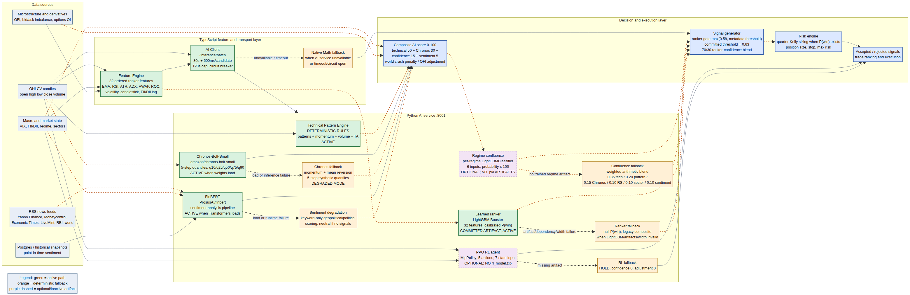

# Mimir Analysis Systems Report

**Repository:** `Scifi-ally/Mimir`
**Audited revision:** `9cfcb58`
**Purpose:** Explain every analysis system in Mimir, identify what is actually active in the current checkout, and show how sentiment analysis connects to the broader ranking and trading pipeline.

## Executive summary

Mimir is not using one single AI model. It is a **multi-stage analysis stack** consisting of deterministic technical analysis, probabilistic time-series forecasting, financial-news sentiment, a learned LightGBM ranker, optional regime confluence models, and an optional PPO reinforcement-learning service. The systems are orchestrated by a Python FastAPI service and consumed by the TypeScript signal generator.

The most important operational distinction is between **implemented**, **artifact-present**, and **actively used**. Chronos and FinBERT are loaded at service startup when their dependencies and pretrained weights are available. The Technical Pattern Engine is always deterministic and active. The learned LightGBM ranker has committed artifacts and is the main learned gate. The PPO model and regime-specific confluence models are implemented but have no serialized artifacts in this checkout, so their fallbacks are currently used.[1] [2] [3]



The editable source for the diagram is available in [`MIMIR_ANALYSIS_SYSTEMS.mmd`](MIMIR_ANALYSIS_SYSTEMS.mmd).

## 1. What is being used now

| System | Exact implementation | Current artifact/status | What it contributes |
|---|---|---|---|
| Technical Pattern Engine | Deterministic Python rules | **Active**; no learned artifact required | `bullish_probability`, confidence, detected candlestick patterns |
| Chronos forecasting | `amazon/chronos-bolt-small` | **Active when model weights load**; momentum/mean-reversion fallback otherwise | Five-step median and quantile close-price forecasts |
| Sentiment analysis | `ProsusAI/finbert` through Transformers | **Active when pipeline loads**; keyword-only or neutral degradation otherwise | Symbol, market, India-political, world, and composite sentiment |
| Learned ranker | LightGBM binary Booster plus isotonic calibration | **Artifact present and intended to be active** | Calibrated `P(target1 before stop)` and trade gate |
| Confluence model | Per-regime `LGBMClassifier` | **Inactive in current checkout**; no `.pkl` artifacts | Regime-specific combination score when trained artifacts exist |
| PPO RL agent | Stable-Baselines3 `PPO("MlpPolicy")` | **Inactive in current checkout**; no `rl_model.zip` | Five-way action, policy confidence, score adjustment |
| Native TypeScript fallback | Deterministic mathematical scoring | **Active only when AI service fails, times out, or circuit breaker opens** | Keeps scanning and ranking available without Python AI service |

The Python service loads sentiment, technical rules, Chronos, and the learned ranker in a background startup thread. The service can therefore be reachable before every model is ready; model status must be read from `/health` rather than inferred merely from process availability.[4]

## 2. Sentiment analysis in detail

### 2.1 Exact sentiment model

The sentiment model is **ProsusAI/finbert**, loaded with the exact Transformers call:

```python
pipeline("sentiment-analysis", model="ProsusAI/finbert")
```

No explicit temperature, top-p, sampling count, device, truncation, maximum token length, or custom tokenizer parameters are supplied by Mimir. These remain controlled by the Transformers pipeline and model defaults.[2]

The pipeline receives the first **15 headlines** from each feed batch. FinBERT labels are converted to signed scalar scores as follows:

| FinBERT output label | Mimir numeric score |
|---|---:|
| `positive` | `+score` |
| `negative` | `-score` |
| Any other label | `0.0` |
| Model unavailable | `0.0` before keyword fallback logic |

Every pipeline call is protected by a process-wide lock because the code explicitly guards against concurrent fast-tokenizer borrowing errors.[2]

### 2.2 News sources and coverage

Mimir separates sentiment into four dimensions:

| Dimension | Feed inputs | Geopolitical keyword amplification |
|---|---|---:|
| Symbol-specific | Yahoo Finance RSS for `<SYMBOL>.NS` | No |
| Market-wide | Moneycontrol, Economic Times, LiveMint | No |
| India political/policy | Economic Times politics, LiveMint politics, RBI policy feed | Yes |
| World | Yahoo World RSS | Yes |

Market-wide, India-political, and world feeds are fetched once per cache interval and shared across symbols. The symbol-specific Yahoo feed is fetched for each requested symbol. The result is therefore partly **symbol-level** and partly **shared macro sentiment**.[2]

### 2.3 Recency weighting

Headline recency is handled by an exponential decay function with a six-hour half-life:

```text
recency_weight = 2 ** (-hours_ago / 6.0)
```

Unparseable or missing publication dates are treated as at least 24 hours old. The headline score is multiplied by this weight, and the weighted average is returned across the batch.[2]

### 2.4 Geopolitical and political keyword layer

The keyword layer is not another ML model. It is a deterministic signed dictionary containing geopolitical, macroeconomic, Indian political, and policy terms. Examples include `war`, `tariff`, `oil supply`, `rbi rate cut`, `india trade deal`, `budget`, `election`, `tax relief`, and `infrastructure spend`.[2]

For each matching headline, Mimir selects the largest-magnitude keyword impact as the dominant signal. Same-direction matches reinforce it by **25% of their magnitude**, while opposite-direction matches dampen it at full weight. The final keyword score is clamped to `[-1, +1]`.[2]

When geopolitical amplification is enabled:

```text
FinBERT available:
  combined = 0.60 * FinBERT_score + 0.40 * keyword_score

FinBERT unavailable or inference failed:
  combined = keyword_score
```

This means sentiment does not disappear completely when FinBERT fails. India-political and world feeds can still influence the system through deterministic keywords. For a headline without a keyword match, the FinBERT score is used unchanged.

### 2.5 Final composite sentiment formula

The final score returned by `analyze_sentiment(symbol)` is:

```text
composite =
    0.30 * symbol_specific_score
  + 0.25 * market_wide_score
  + 0.25 * india_political_score
  + 0.20 * world_score
```

All returned sentiment values are rounded to four decimal places. The normal in-memory cache TTL is **300 seconds**. If FinBERT failed while generating a result, that result uses a shorter effective cache period of **20 seconds** so a temporary model outage does not poison the system for the full five minutes.[2]

### 2.6 How sentiment enters the trading score

The Python composite score gives sentiment a nominal **five-point contribution**:

```text
sentiment_component = sentiment_composite * 5.0
```

The same composite score also applies a macro crash penalty when `world_score < -0.5`:

```text
score -= 15.0
```

The Node client converts Python's `[-1, +1]` sentiment scale to its consumer scale `[0, 100]` using:

```text
((sentiment_score + 1) * 50)
```

It then passes the normalized sentiment into confluence scoring and signal-generation logic.[5] [6]

### 2.7 Historical and point-in-time sentiment

For backtests or requests containing `as_of_date`, the service does not fetch current RSS headlines. It queries historical `sentiment_composite` and `sentiment_world` snapshots from Postgres with `filed_date <= as_of_date`. This is intended to preserve point-in-time behavior and ensure that the historical path can reproduce the same world-sentiment crash penalty as live scoring.[6]

## 3. Technical analysis systems

### 3.1 Technical Pattern Engine

The Technical Pattern Engine is a deterministic rule engine, not a neural network or downloaded model. It evaluates OHLCV candles and optional feature fields. It detects doji, hammer, inverted hammer, shooting star, hanging man, bullish and bearish engulfing, morning and evening star, three white soldiers, and three black crows.[3]

It also adds recent momentum, volume-spike direction, ADX, Stochastic RSI, ATR volatility, RSI, MACD histogram, point-of-control distance, Bollinger width, and VCP contraction signals. The final bullish probability is produced by a sigmoid-like mapping:

```text
bullish_probability = 1 / (1 + exp(-5 * bias))
```

Confidence is clamped to `[0.0, 0.85]`. This output is the main technical component of the Python composite score.

### 3.2 TypeScript Feature Engine

The TypeScript feature engine creates the canonical 32-element vector used by the learned ranker. The ordered fields include RSI, ATR, ADX, volume ratio, VWAP distance, EMA distances and alignment, trend consistency, relative strength, point-of-control distance, Bollinger width, VCP contraction, momentum/trend/volatility/risk-reward scores, price ROC, candle-shape ratios, realized volatility, vol-of-vol, CPR width, and lagged FII/DII flow.[7]

It deliberately excludes live-only regime, sector, and market fields from the ranker vector. If the vector is marked `rankerIncomplete`, the service refuses to create a ranker row rather than silently feeding placeholder values into the learned model.[7]

## 4. Forecasting system

Chronos is loaded as `amazon/chronos-bolt-small`. The loader selects `device_map="auto"` and `torch.float16` on CUDA, otherwise CPU and `torch.float32`. It calls:

```python
predict_quantiles(
    context,
    prediction_length=steps,
    quantile_levels=[0.1, 0.25, 0.5, 0.75, 0.9],
)
```

The default horizon is five steps and public inputs are clamped to one through 30 steps. For highly volatile input series, Mimir applies EMA-3 smoothing to the model input when recent-return volatility exceeds `0.02`, then rebases the forecast to the actual last close.[1]

If model loading or inference fails, the fallback uses five-candle momentum, a 20-candle mean-reversion target, momentum decay `0.7 ** step`, volatility floor `0.001`, and synthetic normal-quantile bands. This fallback is deterministic and not learned.[1]

## 5. Learned ranking and trade gating

The committed LightGBM ranker consumes 32 ordered features and returns calibrated `P(target1 before stop)`. The committed metadata reports a recommended threshold of **0.63**, test AUC **0.723**, test Brier score **0.2335**, take-all expectancy **0.62%**, and greenlight expectancy **1.25%**.[8]

The live signal generator applies:

```text
ranker_threshold = max(0.58, metadata.recommended_threshold)
```

With the current metadata, the effective threshold is **0.63**. A candidate below the threshold is rejected. A passing candidate blends ranker probability with the legacy confidence using **70% ranker / 30% legacy confidence**. The same probability is passed into the risk engine for quarter-Kelly sizing.[9]

If LightGBM, the model artifact, metadata, or feature width is invalid, the ranker returns `None`. The signal generator then continues with the legacy composite ranking instead of fabricating a probability.

## 6. Confluence analysis

The optional confluence system is a regime-specific LightGBM classifier trained on six fields:

`tech_score`, `pattern_score`, `chronos_score`, `rs_score`, `sector_score`, and `sentiment_score`.

Its planned model configuration is `max_depth=3`, `num_leaves=7`, `learning_rate=0.05`, `n_estimators=50`, six positive monotonic constraints, `min_child_samples=5`, and `verbose=-1`. It returns `predict_proba(x)[0, 1] * 100` for the selected regime.[10]

No confluence `.pkl` artifacts are present in the current checkout. The active fallback therefore uses the following weights:

| Input | Fallback weight |
|---|---:|
| Technical score | 0.35 |
| Pattern score | 0.20 |
| Chronos score | 0.15 |
| Relative strength | 0.10 |
| Sector score | 0.10 |
| Sentiment score | 0.10 |

The fallback output is clamped to `[0, 100]`.

## 7. Reinforcement-learning analysis

The optional RL service uses Stable-Baselines3 PPO with `MlpPolicy`, a five-action discrete action space, and a seven-element state containing normalized close, volume, RSI, MACD, VIX, FII/DII net flow, and PCR. Training uses `20,000` timesteps. PCR is fixed at `1.0` during both training and serving because historical options data is unavailable.[11] [12]

The serving action call is `model.predict(state, deterministic=True)`. The output maps to Strong Sell, Sell, Hold, Buy, or Strong Buy. The score adjustment range is `-0.5` to `+0.5`, and confidence is read from the PPO action distribution.[12]

No `rl_model.zip` is present in the current checkout. The current RL endpoint therefore returns `HOLD`, confidence `0.0`, score adjustment `0.0`, and `source="no_model"`.

## 8. Production flow in plain language

The TypeScript backend creates candle features and sends candidates to the Python AI service. The Python service forecasts all candidates with Chronos in one batch, predicts all valid ranker rows with LightGBM in one batch, then processes each candidate with technical rules and sentiment. It combines those outputs into a composite score and returns batch-level ranker metadata.[6]

The Node signal generator then applies the learned-ranker gate, confluence or native confidence calculation, minimum-confidence and market-structure gates, multi-timeframe checks, regime-direction checks, earnings filters, and risk assessment. The final result is either an accepted trade signal or a rejection trace containing the reason.

When the Python service is unavailable, the Node client uses a native mathematical fallback and opens a circuit breaker after five failures. The default timeout is **30 seconds plus 500 milliseconds per candidate**, capped at **120 seconds**.[5]

## 9. Bottom line

> **Sentiment analysis is a real part of the active Mimir scoring path, but it is not the primary trade gate.** FinBERT scores up to 15 recent headlines, recency-weights them, blends selected geopolitical and political keywords, and produces four sentiment dimensions plus a composite. That composite contributes five points to the Python score, while severe negative world sentiment can subtract 15 points. The learned LightGBM ranker remains the primary learned gate, and the deterministic Technical Pattern Engine remains the primary technical probability source.

The complete editable diagram is [`MIMIR_ANALYSIS_SYSTEMS.mmd`](MIMIR_ANALYSIS_SYSTEMS.mmd), and the rendered diagram is [`MIMIR_ANALYSIS_SYSTEMS.png`](MIMIR_ANALYSIS_SYSTEMS.png).

## References

[1]: https://github.com/Scifi-ally/Mimir/blob/9cfcb58/backend/ai_service/models/chronos_service.py "Chronos forecasting service"
[2]: https://github.com/Scifi-ally/Mimir/blob/9cfcb58/backend/ai_service/sentiment.py "FinBERT sentiment implementation"
[3]: https://github.com/Scifi-ally/Mimir/blob/9cfcb58/backend/ai_service/models/technical_pattern_engine.py "Technical Pattern Engine"
[4]: https://github.com/Scifi-ally/Mimir/blob/9cfcb58/backend/ai_service/main.py "AI service startup and orchestration"
[5]: https://github.com/Scifi-ally/Mimir/blob/9cfcb58/backend/src/analysis/ai_client.ts "Node AI client and fallback behavior"
[6]: https://github.com/Scifi-ally/Mimir/blob/9cfcb58/backend/ai_service/main.py "AI batch inference and point-in-time sentiment path"
[7]: https://github.com/Scifi-ally/Mimir/blob/9cfcb58/backend/src/analysis/feature_engine.ts "Canonical ranker feature contract"
[8]: https://github.com/Scifi-ally/Mimir/blob/9cfcb58/backend/ai_service/ranker_meta.json "Committed ranker metadata"
[9]: https://github.com/Scifi-ally/Mimir/blob/9cfcb58/backend/src/analysis/signal_generator.ts "Signal gating and risk handoff"
[10]: https://github.com/Scifi-ally/Mimir/blob/9cfcb58/backend/ai_service/train_confluence.py "Confluence trainer"
[11]: https://github.com/Scifi-ally/Mimir/blob/9cfcb58/backend/ai_service/train_rl.py "PPO training script"
[12]: https://github.com/Scifi-ally/Mimir/blob/9cfcb58/backend/ai_service/models/rl_agent.py "PPO serving implementation"
