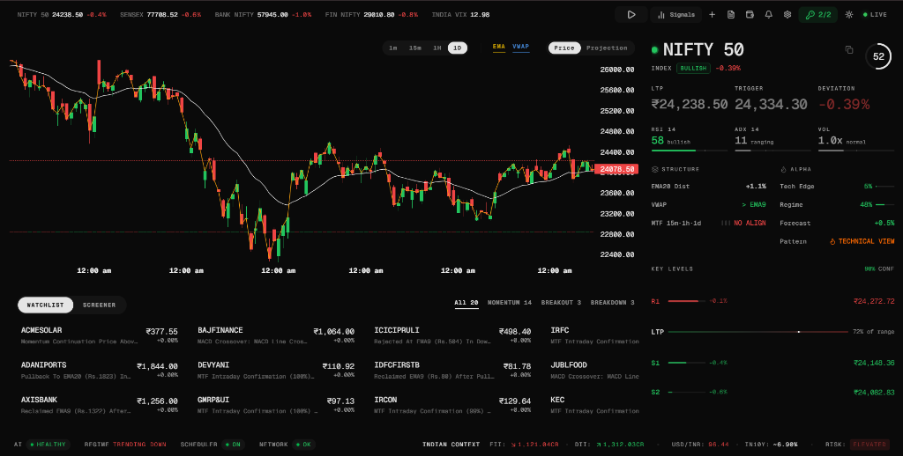
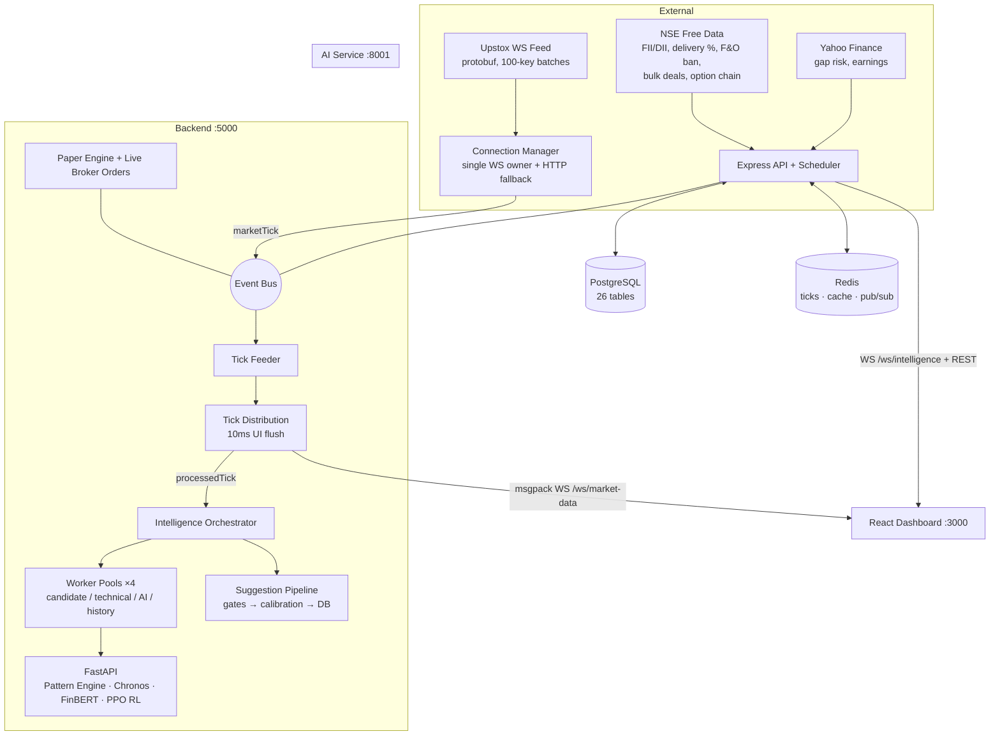

<div style="font-family: 'Geist Mono', monospace;">

# Mimir

<div align="center">


**A Production-Ready Algorithmic Trading Engine for the Indian Stock Market.**

[Key Features](#key-features) • [System Architecture](#system-architecture) • [Getting Started](#getting-started) • [Security Standards](#security--safety-defaults) • [Contributing](CONTRIBUTING.md)

---

</div>

## Dashboard Preview

<div align="center">
  
</div>

---

## Overview

Mimir is a self-hosted platform for quantitative analysis and monitoring of the Indian stock market. The platform focuses on ultra-low latency data processing and real-time algorithmic execution, offering capabilities usually restricted to institutional platforms.

Key service capabilities include:

1. **WebSocket Telemetry**: Live streaming of NSE/BSE tick distributions and market depth.
2. **AI Intelligence Engine**: A Python FastAPI microservice evaluating multi-timeframe momentum, Reinforcement Learning (PPO) action predictions, LLM-based sentiment analysis (FinBERT), and a dedicated Ranker Service for portfolio selection.
3. **Self-Hosted Security**: API keys, trading strategies, and order logs remain strictly on local infrastructure.

---

## Key Features

### Market Telemetry & Charting
* **Canvas Charting**: Rendered via TradingView lightweight-charts, supporting EMA, VWAP, Support/Resistance zones, and price projection overlays.
* **Tick-by-Tick Order Book**: Live market depth monitoring and tick distribution analysis.

### Advanced Quantitative Modules
* **Divergence Engine**: Automated detection of RSI and MACD divergences against price action.
* **Order Flow Analysis**: Deep evaluation of institutional accumulation and distribution phases.
* **Fundamental & Alpha Health Tracking**: Integration of structural health and institutional flow schemas.

### Custom Screener & Rule Engine
* **Interactive Rule Builder**: Construct conditional scanning rules across price action and technical indicators.
* **Background Scanning**: Background worker pool continuously evaluates active symbols against custom screener conditions.

### Risk Management
* **Paper Trading Engine**: Test quantitative strategies in live market conditions with order fill simulation.
* **Automated Risk Guardrails**: Built-in automated stop-loss trailing and daily loss thresholds.

### Recent Enhancements
* **AI Reinforcement Learning & Ranker**: Nightly retrained PPO RL agent and a new Ranker Service to intelligently filter and score opportunities.
* **Dynamic Island UI**: Seamless status updates, toast notifications, and event streams decoupled from the primary charting interface.
* **Adaptive Layout Modes**: Flexible and customizable UI layouts to focus purely on signals, charting, or complete terminal views.
* **Pure Digital Scanner**: A visually stunning digital display during overnight scan jobs, removing clutter and showing an elegant count.
* **Custom Watchlists**: Seamless command-palette integration for dynamic on-the-fly manual symbol monitoring.
* **Rate-Limit Resilient Architecture**: Smarter WebSocket debouncing and targeted live-price fetching prevents upstream API exhaustion during intense real-time scans.
* **Brutal Codebase Optimizations**: Major backend architectural cleanup resulting in streamlined workflows, zero circular dependencies, and a leaner system.

---

## Backtesting Reality & Live Gating

Our extensive historical backtests proved a critical reality: **raw technical setups (Breakouts, Mean Reversions, Momentum) have a negative mathematical expectancy after slippage and costs.** 

To counteract this drift, Mimir strictly disables poor-performing setups and forces surviving signals (e.g., Momentum Continuation) through a brutal live gate. A signal is only traded if it passes strict volume expansion thresholds, positive Relative Strength (RS), and tight ATR-based risk profiling. The system trades rarely by design, prioritizing capital preservation over raw signal volume.

---

## System Architecture

Mimir is a decoupled, event-driven system: a Node/TypeScript backend that owns the market-data feed and trading engines, a Python FastAPI microservice for model inference, PostgreSQL + Redis for persistence and hot state, and a React dashboard fed over binary WebSockets. Everything below is documented from the code.



### 1. Real-time data pipeline

The hot path from exchange to pixel:

**Connection Manager** (`intelligence/connection_manager.ts`) is the single owner of the Upstox WebSocket. It authorizes via `/v3/feed/market-data-feed/authorize`, decodes the protobuf `FeedResponse` stream, and publishes normalized `marketTick` events on the in-process event bus. Subscriptions go out in batches of 100 instrument keys — indices in `ltpc` mode, equities in `full` mode (bid/ask + OHLC + volume). Resilience: circuit breaker (5 failures → 5-min cooldown), exponential reconnect with jitter, and an HTTP fallback poller (every 2s) that publishes the same `marketTick` events via REST LTP when the socket is silent, so the UI never distinguishes between sources.

**Tick Feeder** (`market_data/tick_feeder.ts`) consumes `marketTick`: drops stale (>2s) and unchanged ticks, maintains per-symbol tick history and session OHLC, updates sector rotation, broadcasts index prices (NIFTY 50 / SENSEX / BANKNIFTY / FINNIFTY / VIX) to the dashboard, and batches ticks to Redis every 1s. A 60s REST poller backfills real volume for equities (the WS index mode has none).

**Tick Distribution** (`market_data/tick_distribution.ts`) decouples ingestion from consumers: an O(1) tick cache plus a 5-minute rolling history per symbol. Every **10ms** it flushes dirty symbols to the frontend as compact msgpack arrays (`[symbol, ltp, volume, bid, ask, ts, changePct]`), and re-publishes each tick as `processedTick` for the analysis layer — two event names (`marketTick` vs `processedTick`) deliberately prevent a feedback loop.

**Symbol subscription control** (`market_data/monitored_symbols.ts`) decides what's on the feed: manual UI-requested symbols (never evicted) → overnight watchlist → active suggestions, capped at `FEED_MAX_STOCKS` (default 500). When a dashboard client selects or watches a symbol, the WS server dynamically joins it to the Upstox feed and fetches an instant REST quote so the UI paints before the first tick.

**Load Balancer** (`intelligence/load_balancer.ts`) arbitrates API quota: during an off-hours scan the tick feed is fully paused (scans get 100% of the 10 req/s Upstox budget); during market-hours scans it throttles instead.

### 2. Live intelligence engine

The orchestrator (`intelligence/orchestrator.ts`) runs a four-stage funnel over the live feed, each stage in its own `worker_threads` pool so analysis never blocks the tick path:

1. **Candidate detection** (2 workers, throttled to once per 2s per symbol) — stateless scoring of live session state: relative volume ≥1.15×, range expansion, proximity to day high, momentum, ≥₹1cr turnover.
2. **Technical analysis** (2 workers) — indicator snapshot from the last 80 one-minute candles (built in-process by the candle builder, no API calls), EMA9/EMA20 alignment + ADX gates, ATR-based stop, 2R target.
3. **AI ranking** (1 worker, debounced 2s) — batches qualified opportunities to the Python AI service, blends `0.4·technical + 0.6·AI`, applies regime-aware penalties and RL agent agree/disagree adjustments, deterministic fallback if the service is down.
4. **Suggestion generation** — top 5 ranked opportunities pass through the full gate stack (below) and persist to the DB.

A breadth engine reclassifies market internals every 1s from all live ticks (advancers/decliners → Risk-On/Bullish/Ranging/Bearish/Risk-Off), and a 5s frontend timer pushes top-20 movers + active suggestions to the dashboard.

### 3. Scanning system

Scheduled scanners feed the overnight watchlist that seeds the next session's feed:

| Scanner | When | What |
|---|---|---|
| Post-market full scan | 15:31 IST daily | Entire NSE universe (~2000 stocks), unrushed, builds tomorrow's watchlist |
| Overnight scanner | 15:45 IST | Qualified setups with category + priority |
| Gap scanner | 09:12 IST | Pre-market gap candidates |
| Intraday scanner | market hours | 1h/4h developing setups, not just pre-market picks |
| Mean-reversion / range scanners | regime-gated | Only active in SIDEWAYS_RANGE / LOW_VOLATILITY_SQUEEZE regimes |
| Custom screener | user-scheduled | User-built AND/OR rule trees from the dashboard |

The **Scanner Activation Engine** enables/disables scanner types per regime, so the system only hunts setups that make sense in the current market environment. Scans run through a `scan_runs` persistence table for idempotent restarts, and a workflow coordinator mutex guarantees only one scan workflow at a time.

**Setup detectors** (`analysis/technical.ts`, also used by the scan worker pool): BREAKOUT, PULLBACK, MOMENTUM_CONTINUATION, EMA9_RECLAIM/REJECTION, BREAKDOWN, BEAR_MOMENTUM, MACD_CROSSOVER, BOLLINGER_SQUEEZE_BREAKOUT, LIQUIDITY_SWEEP, mean-reversion and range setups — each scored 0–10 with swing/ATR/SuperTrend hybrid stops and 2R–4R targets. Setups with backtest-proven negative expectancy (documented in the code with their measured win rates) are still detected for monitoring but **never become trade suggestions**.

### 4. Signal → suggestion pipeline (the gate stack)

Every candidate signal must survive, in order (`suggestions/generator.ts`):

1. **Walk-forward demotion** — setups whose rolling 90-day realized expectancy is negative are auto-demoted (and auto-restored when it recovers).
2. **F&O ban list** — hard reject (NSE free data).
3. **Corporate-action blackout** — no positions into results/dividends/splits within 3 days.
4. **Market internals** — VIX spike halt (>+8%/hour), breadth and sector-relative-strength gates.
5. **Delivery % gate** — momentum BUYs need ≥25% delivery (fake-breakout filter).
6. **Live price sanity** — reject chased entries (price already past entry) and recompute live risk:reward, minimum 1.3.
7. **Overnight gap risk** — no new swings into HIGH implied-gap nights (GIFT Nifty / ES=F / USDINR).
8. **One open suggestion per symbol per day.**

Survivors get:
- **Empirical confidence calibration** (`analysis/calibration_engine.ts`) — model confidence blended with the setup's realized win rate over 120 days; empirical weight scales `min(n,50)/50`, pass-through below 10 samples.
- **Attainability timing** (`suggestions/timing.ts`) — expected hold time blends the setup's realized median time-to-target (60%) with an ATR-distance heuristic (40%); expiry is session-aware (IST market close, weekend skip; swings capped at 10 trading days per backtest evidence).
- **Honest fill model** — inserted as `PENDING` unless price is already at entry; the accuracy tracker promotes to `ACTIVE` only when entry actually touches, so win-rate stats never count fills that never happened.

**Outcome tracking** (`suggestions/accuracy_tracker.ts`) checks every active suggestion against live prices each minute: stop checked before target (pessimistic on ambiguity), P&L net of transaction costs (0.05%/side), MFE/MAE watermarks recorded atomically for calibration. Results feed back into the **learning engine** (nightly at 16:00 IST): sector/regime/confidence-bucket analysis, adaptive component weights for the confidence formula, risk auto-tuning (win rate <35% → capital preservation mode, >65% → aggressive), and RL retraining triggers.

### 5. Risk & trading engines

**Risk Engine** (`analysis/risk_engine.ts`) always overrides AI — position sizing from fixed-% risk tiered by confidence (0.5%–1.5% of capital), daily/weekly loss limits with automatic suggestion pausing, drawdown circuit breaker (3% daily → halt).

**Paper Engine** (`trading/paper_engine.ts`) is the source-of-truth book in both modes: event-driven fills with 0.05% slippage, 2% spread guard, MIS 5× leverage margin math in Decimal.js, atomic `SELECT FOR UPDATE` transactions, R-multiple ratcheting trailing stops, and circuit-limit detection (zero-liquidity ticks defer exit, then force at 0.5% slippage). In LIVE mode every paper fill mirrors to Upstox via `trading/broker_orders.ts` — market orders only, with a `live_orders` audit row written *before* the HTTP call so a crash leaves a reconcilable orphan rather than an untracked order. Arming LIVE requires typing a confirmation phrase in the dashboard.

**Position Tracker** (`trading/position_tracker.ts`) maintains per-suggestion stop state with three modes: FIXED, TRAILING (ATR ratchet), BREAKEVEN (stop → entry at 1R, then trails).

### 6. AI microservice (`backend/ai_service`, FastAPI :8001)

Loads models once in a background thread (the port binds immediately; health reports "degraded" until ready) and degrades to rule-based fallbacks on any load failure:

| Model | Role |
|---|---|
| Technical Pattern Engine | OHLCV → bullish probability + detected patterns |
| Chronos-Bolt-Tiny | Time-series forecast (median + quantile fan, drives the chart's forecast mode) |
| FinBERT | News sentiment from 7 RSS feeds with 6h-half-life recency decay and geopolitical amplification |
| PPO RL Agent | Action prediction (BUY/SELL/HOLD) blended into ranking; retrained nightly from actual trade outcomes |
| Ranker Service | Evaluates all active signals and intelligently ranks the top opportunities for the portfolio |

Composite score: `bullish_prob×50 + sigmoid(forecast_return×3)×30 + confidence×15 + sentiment×5`, dynamically adjusted by the Ranker Service and RL agent agree/disagree multipliers, clamped 0–100. Batch endpoint handles 200 candidates with per-candidate error isolation. Auth via constant-time `X-AI-Service-Token` check.

### 7. Scheduler

~30 cron jobs (all `Asia/Kolkata`, mutex-protected, market-open takes a Redis distributed lock). The trading day: 07:00 FII/DII → 07:30 corporate actions → 07:45 NSE free data → 08:00 daily reset → 08:30 gap risk → 09:12 gap scan → **09:15 market open** (feed init, 300ms monitoring loop) → every 5 min suggestion generation + macro refresh, every 1 min outcome checks and loss-limit tally → **15:30 close** → 15:31 full scan → 15:45 overnight scan → 16:00 learning pipeline → 16:05 calibration refresh → 16:15 daily report → midnight cleanup. Weekly: setup demotion check (Fri), alpha-score IC monitor (Sat).

### 8. Frontend (React 19 + Vite :3000)

Three distinct state planes, chosen per data velocity:

- **Prices** never touch React state managers: a module-singleton `MarketDataStore` consumed via `useSyncExternalStore` with per-symbol subscriber sets — a tick re-renders only the atoms (`LivePrice`, `LiveChangePct`, sparklines) watching that symbol. Source priority: WebSocket > REST > cache.
- **App state** (scan progress, alerts, Dynamic Island, event feed, selected symbol) lives in a Zustand store.
- **Server data** (watchlist, suggestions, regime, paper account) lives in React Query with long polling intervals — WS events invalidate or directly patch the cache, so polling is a fallback, not the freshness mechanism.

WS handling is off-thread: both sockets (`/ws/intelligence`, `/ws/market-data`) forward raw frames to a Web Worker that decodes msgpack and coalesces ticks into 150ms batches; the main thread applies them under `requestAnimationFrame`. The chart (lightweight-charts v5) builds its live candle by aligning ticks to the historical candle grid with spike rejection and gap backfill; forecast mode plots the Chronos quantile fan on future business days. The watchlist virtualizes horizontally (TanStack Virtual) over columns of three cards.

WebSocket protocol: zod-validated events, msgpack binary encoding, per-client symbol filtering (each client receives only ticks for symbols it subscribed), channel routing (tick traffic isolated to `/ws/market-data`), token auth with per-IP rate limiting and timing-safe comparison.

### 9. Persistence

**PostgreSQL** (Drizzle ORM, 26 tables): suggestions lifecycle + outcomes, paper accounts/orders/positions, live order audit trail, candle cache, market regimes/metrics time series, learning analytics + per-symbol×regime metrics, calibration inputs (signal outcomes, alpha-score IC history), custom screener rules/runs/matches, institutional flows, encrypted Upstox tokens, singleton trading config.

**Redis** (three distinct roles): per-symbol tick persistence (1s batched, seeds feed state on restart), TTL'd intelligence snapshots (universe / frontend / breadth / suggestions), and a pub/sub channel bridging backend alerts to dashboard WebSocket clients. Every consumer degrades gracefully when Redis is down.

### 10. Auth & security

- **Dual Upstox API keys**: trading key drives the WS feed + orders; a second data key (optional, `useDualApiKeys`) carries scanner/historical REST traffic — two separate rate-limit budgets. Tokens encrypted at rest (AES-256-GCM), auto-fallback if one key lacks a valid token.
- **Admin boundary**: localhost is trusted; remote HTTP/WS requires `UPSTOXBOT_ADMIN_TOKEN` (timing-safe compare, per-IP attempt limiting with bans).
- **Rate limiting**: Redis sliding-window (10/min auth paths, 100/min default).
- **Live-trading arming**: typed confirmation phrase, PAPER is the default mode, all live orders audited to `live_orders`.

### Ports

| Port | Service |
|---|---|
| 3000 | Frontend (vite preview / nginx in Docker) |
| 5000 | Backend API + trading engine + WebSockets |
| 5433 | PostgreSQL (portable `bot.bat` install; Docker uses 5432) |
| 6379 | Redis |
| 8001 | AI microservice (localhost-bound) |

---

## Security & Safety Defaults

* **Restricted Admin Access**: Remote backend API access is disabled by default unless explicitly authenticated via `UPSTOXBOT_ADMIN_TOKEN`.
* **Rate Limiting**: Public API endpoints enforce token-bucket rate limiting (100 requests per minute for standard APIs, 10 requests per minute for authentication endpoints).
* **CORS Hardening**: Cross-Origin Resource Sharing is strictly restricted to verified local and production origins via `AI_CORS_ORIGINS`.
* **Zero Hardcoded Secrets**: Credentials, Upstox OAuth tokens, and API secrets are managed via environment variables and encrypted database schemas.

---

## Remote Access & Cloudflare Tunnels

Mimir is designed to execute locally. If deployment requires exposure to the public internet (e.g., via Cloudflare Tunnels), rigorous authentication protocols must be configured to secure data and Upstox API credentials.

1. Define the `UPSTOXBOT_ADMIN_TOKEN` environment variable in the `.env` file as a cryptographically secure string.
2. The WebSocket telemetry and REST API endpoints will automatically enforce this token for external connections.
3. In the frontend environment, authenticate by persisting this token in browser local storage: `localStorage.setItem('mimir_admin_token', 'your_secure_token')`.
4. **Tunnel Opt-In**: The `bot.bat` launcher does not initiate the Cloudflare tunnel by default. To start the tunnel, explicitly execute `bot.bat tunnel <port>`.

---

## Hardware Requirements

* **Minimum Requirements**: 4GB RAM, Dual-Core CPU (Intel i3 / AMD Ryzen 3 or equivalent), Windows 10/11 (for the portable setup).
* **AI Service (Optional but Recommended)**: The AI service runs heavily on the CPU if a dedicated GPU is not present. For laptops with low hardware specs, startup might take 1-2 minutes longer as models load into memory. The system is configured to gracefully run offline without pinging HuggingFace (`HF_HUB_OFFLINE=1`), making it perfectly fine for standard laptops.

---

## 🚀 Portable Windows Setup (1-Click Quickstart)

If you are on Windows, you **do not** need to install Node.js, Python, PostgreSQL, or Redis manually! You can use our zero-dependency portable installer:

1. Clone or download this repository.
2. Double-click the **`setup.bat`** file in the root folder.
3. The script will automatically download and configure all necessary dependencies (`.portable` folder), initialize the database, and install npm packages.
4. Once finished, run **`bot.bat start`** to boot the entire system!

---

## Developer Manual Setup

### Prerequisites
* **Node.js** (v22.0 or higher)
* **Python** (v3.12 or higher)
* **PostgreSQL** (v16.0 or higher)
* **Redis** (v7.0 or higher - optional, defaults to in-memory fallback)

### 1. Environment Setup
Clone the repository and duplicate the environment template:
```bash
git clone https://github.com/Scifi-ally/Mimir.git
cd Mimir
cp .env.example .env
```
Configure your PostgreSQL database connection string and Upstox API credentials in `.env`.

### 2. Installation
Install dependencies across all system components:
```bash
# Install root and backend dependencies
npm install
npm --prefix backend install --legacy-peer-deps

# Install Python AI service dependencies
pip install -r backend/ai_service/requirements.txt
```

### 3. Database Initialization
Run automated database schema migrations and table setup:
```bash
npm run setup:db
```

### 4. Running Locally
Launch the application services in development mode:
```bash
# Terminal 1: Start the Express Backend API
npm run dev:backend

# Terminal 2: Start the Python Intelligence Service
uvicorn main:app --app-dir backend/ai_service --host 127.0.0.1 --port 8001

# Terminal 3: Start the React Frontend Dashboard
npm --prefix frontend run dev
```

* **Frontend Dashboard**: `http://localhost:3000` (or `5173`)
* **Backend API**: `http://localhost:5000`
* **AI Service**: `http://localhost:8001`

---

## Windows One-Click Launch (`bot.bat`)

For Windows environments, Mimir includes an automated launcher that manages background process spawning and port verification:
```cmd
bot.bat
```
To start the application and automatically open an opt-in Cloudflare tunnel:
```cmd
bot.bat tunnel 3000
```
To terminate all running services and tunnels cleanly:
```cmd
bot.bat stop
```

---

## Docker Deployment

To initialize the entire stack (Frontend, Backend, AI Engine, PostgreSQL, and Redis) within isolated containerized environments:
```bash
docker compose up --build -d
```

---

## Quality Assurance & Testing

Execute the automated test suites and static type validation prior to deployment:
```bash
npm run typecheck
npm test
npm run build
```

---

## Contributing & Community

Contributions are encouraged from developers, quantitative analysts, and open-source enthusiasts.
* Please review the [Contributing Guidelines](CONTRIBUTING.md) for details on setting up your environment and submitting Pull Requests.
* Please adhere to the [Code of Conduct](CODE_OF_CONDUCT.md) in all community interactions.

## License

This project is open-source and licensed under the terms of the [MIT License](LICENSE).

---

## Known Architectural Limitations

While this platform offers robust retail-level monitoring and analysis, it is necessary to acknowledge its architectural limits. **This system is a retail-level setup masquerading as an institutional platform.** True High-Frequency Trading (HFT) and institutional operations require infrastructure that Mimir fundamentally lacks:

1. **Tick-Level Storage**: The current PostgreSQL architecture is entirely unsuited for storing or querying true HFT tick-level data at scale.
2. **Time-Series Processing**: Redis is utilized strictly for volatile state caching and rate limiting, not as a high-performance time-series database. 
3. **Hardware & Infrastructure**: A strict institutional setup demands specialized time-series databases (e.g., TimescaleDB or KDB+), network colocation services, and FPGA hardware for sub-millisecond execution—none of which are provided by this architecture.

</div>