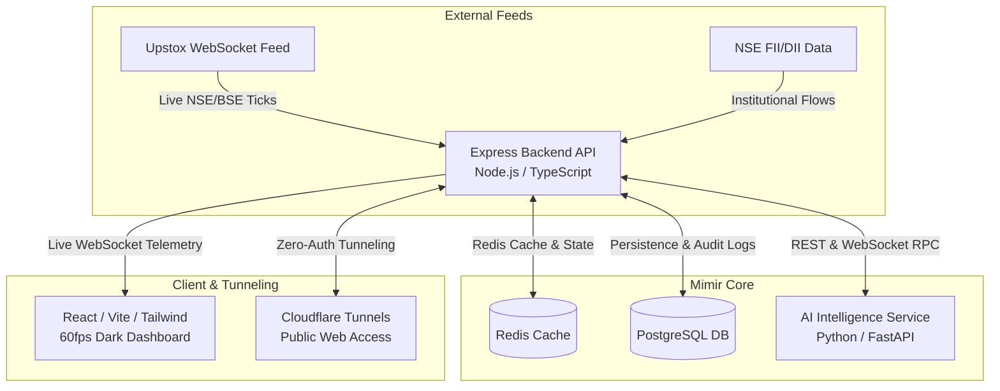

<div style="font-family: 'Geist Mono', monospace;">

# Mimir

<div align="center">


**An Institutional-Grade, AI-Assisted Indian Stock Market Monitoring & Automated Trading Analysis Platform.**

[Key Features](#-key-features) • [System Architecture](#-system-architecture) • [Getting Started](#-getting-started) • [Security Standards](#-security--safety-defaults) • [Contributing](CONTRIBUTING.md)

---

</div>

## Dashboard Preview

<div align="center">
  
</div>

---

## Why Mimir?

Traditional retail trading terminals are often bogged down by high-latency DOM updates, restrictive indicator customization, and black-box quantitative scoring. **Mimir** bridges the gap between retail trading interfaces and institutional quantitative analysis by offering:

1. **Sub-Second WebSocket Telemetry**: Direct ingestion of live NSE/BSE tick distributions and market depth without browser lag or DOM throttling.
2. **Transparent AI Alpha Ranking**: A dedicated Python FastAPI intelligence engine evaluating multi-timeframe momentum, liquidity surges, and regime alignment in real time.
3. **Institutional Flow Tracking**: Integrated real-time tracking of Foreign Institutional Investors (FII) and Domestic Institutional Investors (DII) cash flows.
4. **100% Private & Self-Hosted**: Your API keys, trading strategies, and order logs remain strictly on your infrastructure—no third-party cloud data harvesting.

---

## Key Features

### Real-Time Market Telemetry & Charting
* **Custom Canvas Candlesticks**: High-performance 60fps charting rendered via custom canvas graphics, supporting EMA, VWAP, Support/Resistance zones, and price projection overlays.
* **Tick-by-Tick Order Book**: Live market depth monitoring and tick distribution analysis to spot institutional accumulation and distribution zones.

### 🤖 AI Alpha Factors & Predictive Modeling
* **Composite Alpha Score (0–100)**: Real-time quantitative scoring combining Trend Alignment, RSI Momentum, Volume Surges, and Multi-Timeframe Confluence.
* **Regime Classification**: Automated classification of market states (Bullish Trend, Bearish Momentum, Pullback, or Sideways Range) to dynamically adjust trading strategies.

### Custom Screener & Rule Engine
* **Interactive Rule Builder**: Build complex conditional scanning rules across price action, technical indicators, and institutional order flow without writing code.
* **Persistent Background Scanning**: Dedicated background worker pool continuously evaluating 500+ Nifty/BSE symbols against custom screener conditions.

### Paper Trading & Risk Management
* **Zero-Risk Simulation Engine**: Test quantitative strategies in real-time market conditions with realistic order fill simulation and slippage estimation.
* **Automated Risk Guardrails**: Built-in automated stop-loss trailing, daily loss thresholds, and strict portfolio exposure limits to protect capital.

---

## System Architecture

Mimir operates as a decoupled, high-throughput multi-service architecture designed for resilience and horizontal scalability:



1. **Backend API (`/backend`)**: Handles Upstox OAuth2 authentication, WebSocket connection pooling, order execution management, and system telemetry.
2. **Intelligence Service (`/backend/ai_service`)**: Executes heavy numerical calculations, sentiment evaluations, and automated signal generation without blocking the primary Node.js I/O thread.
3. **Frontend Interface (`/frontend`)**: A state-of-the-art dark-mode trading interface utilizing custom canvas charting, sparklines, and dynamic notification drawers.
4. **Persistence Layer (`PostgreSQL` & `Redis`)**: Relational storage for historical market data, user watchlists, and audit logs, paired with Redis for high-speed state caching.

---

## Security & Safety Defaults

* **Restricted Admin Access**: Remote backend API access is disabled by default unless explicitly authenticated via `UPSTOXBOT_ADMIN_TOKEN`.
* **Rate Limiting & DoS Protection**: Public API endpoints enforce strict token-bucket rate limiting (120 requests per minute) to prevent Denial of Service (DoS) and API abuse.
* **CORS Hardening**: Cross-Origin Resource Sharing is strictly restricted to verified local and production origins via `AI_CORS_ORIGINS`.
* **Zero Hardcoded Secrets**: All credentials, Upstox OAuth tokens, and API secrets are dynamically managed via environment variables and encrypted database schemas.
* **Public Tunneling Compatibility**: Configured with Cloudflare Tunnels (`cloudflared`) by default to ensure uninterrupted, zero-auth real-time WebSocket telemetry for live stock feeds (avoiding interstitial proxy restrictions common in alternative tunneling services like Ngrok).

---

## Getting Started

### Prerequisites
* **Node.js** (v22.0 or higher)
* **Python** (v3.12 or higher)
* **PostgreSQL** (v16.0 or higher)
* **Redis** (v7.0 or higher - optional, defaults to in-memory fallback)

### 1. Environment Setup
Clone the repository and duplicate the environment template:
```bash
git clone https://github.com/Scifi-ally/Mimir.git
cd Mimir
cp .env.example .env
```
Configure your PostgreSQL database connection string and Upstox API credentials in `.env`.

### 2. Installation
Install dependencies across all system components:
```bash
# Install root and backend dependencies
npm install
npm --prefix backend install --legacy-peer-deps

# Install Python AI service dependencies
pip install -r backend/ai_service/requirements.txt
```

### 3. Database Initialization
Run automated database schema migrations and table setup:
```bash
npm run setup:db
```

### 4. Running Locally
Launch the application services in development mode:
```bash
# Terminal 1: Start the Express Backend API
npm run dev:backend

# Terminal 2: Start the Python Intelligence Service
uvicorn main:app --app-dir backend/ai_service --host 0.0.0.0 --port 8001

# Terminal 3: Start the React Frontend Dashboard
npm --prefix frontend run dev
```

* **Frontend Dashboard**: `http://localhost:3000` (or `5173`)
* **Backend API**: `http://localhost:5000`
* **AI Service**: `http://localhost:8001`

---

## 🪟 Windows One-Click Launch (`bot.bat`)

For Windows users, Mimir includes an automated one-click launcher that manages background process spawning, port verification, and public Cloudflare tunneling automatically:
```cmd
bot.bat
```
To stop all running services and tunnels cleanly:
```cmd
bot.bat stop
```

---

## Docker Deployment

To launch the entire stack (Frontend, Backend, AI Engine, PostgreSQL, and Redis) in an isolated containerized environment:
```bash
docker compose up --build -d
```

---

## 🧪 Quality Assurance & Testing

Run the automated test suites and type validation before deploying:
```bash
npm run typecheck
npm test
npm run build
```

---

## 🤝 Contributing & Community

We welcome contributions from quantitative developers, traders, and open-source enthusiasts!
* Please see our [Contributing Guidelines](CONTRIBUTING.md) for details on setting up your environment and submitting Pull Requests.
* Please adhere to our [Code of Conduct](CODE_OF_CONDUCT.md) in all community interactions.

## License

This project is open-source and licensed under the terms of the [MIT License](LICENSE).

---

<div align="center">
  <i>Engineered with a focus on institutional-grade execution safety and real-time market transparency.</i>
</div>


</div>