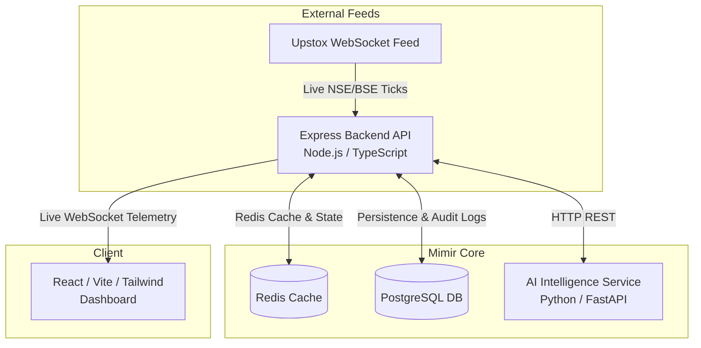

<div style="font-family: 'Geist Mono', monospace;">

# Mimir

<div align="center">


**An AI-Assisted Indian Stock Market Monitoring & Automated Trading Analysis Platform.**

[Key Features](#-key-features) • [System Architecture](#-system-architecture) • [Getting Started](#-getting-started) • [Security Standards](#-security--safety-defaults) • [Contributing](CONTRIBUTING.md)

---

</div>

## Dashboard Preview

<div align="center">
  
</div>

---

## Overview

Mimir is a self-hosted platform for quantitative analysis and monitoring of the Indian stock market. It provides:

1. **WebSocket Telemetry**: Live streaming of NSE/BSE tick distributions and market depth.
2. **AI Alpha Ranking**: A Python FastAPI intelligence engine evaluating multi-timeframe momentum, liquidity surges, and regime alignment.
3. **Self-Hosted Data**: API keys, trading strategies, and order logs remain strictly on your infrastructure.

---

## Key Features

### Market Telemetry & Charting
* **Canvas Charting**: Rendered via TradingView lightweight-charts, supporting EMA, VWAP, Support/Resistance zones, and price projection overlays.
* **Tick-by-Tick Order Book**: Live market depth monitoring and tick distribution analysis.

### AI Alpha Factors & Predictive Modeling
* **Composite Alpha Score (0–100)**: Quantitative scoring combining Trend Alignment, RSI Momentum, Volume Surges, and Multi-Timeframe Confluence.
* **Regime Classification**: Automated classification of market states (Bullish Trend, Bearish Momentum, Pullback, or Sideways Range).

### Custom Screener & Rule Engine
* **Interactive Rule Builder**: Build conditional scanning rules across price action and technical indicators.
* **Background Scanning**: Background worker pool continuously evaluates active symbols against custom screener conditions.

### Paper Trading & Risk Management
* **Paper Trading Engine**: Test quantitative strategies in live market conditions with order fill simulation.
* **Automated Risk Guardrails**: Built-in automated stop-loss trailing and daily loss thresholds.

---

## System Architecture

Mimir operates as a decoupled multi-service application:



1. **Backend API (`/backend`)**: Handles Upstox OAuth2 authentication, WebSocket connection pooling, order execution management, and system telemetry.
2. **Intelligence Service (`/backend/ai_service`)**: Executes numerical calculations, sentiment evaluations, and automated signal generation.
3. **Frontend Interface (`/frontend`)**: A React-based trading interface utilizing canvas charting and sparklines.
4. **Persistence Layer (`PostgreSQL` & `Redis`)**: Relational storage for historical market data, user watchlists, and audit logs, paired with Redis for state caching.

---

## Security & Safety Defaults

* **Restricted Admin Access**: Remote backend API access is disabled by default unless explicitly authenticated via `UPSTOXBOT_ADMIN_TOKEN`.
* **Rate Limiting**: Public API endpoints enforce token-bucket rate limiting (100 requests per minute for standard APIs, 10 requests per minute for authentication endpoints).
* **CORS Hardening**: Cross-Origin Resource Sharing is strictly restricted to verified local and production origins via `AI_CORS_ORIGINS`.
* **Zero Hardcoded Secrets**: Credentials, Upstox OAuth tokens, and API secrets are managed via environment variables and encrypted database schemas.

---

## Remote Access & Cloudflare Tunnels

Mimir is designed to run locally. If you choose to expose it to the public internet (e.g., via Cloudflare Tunnels), you **must** configure authentication to secure your data and Upstox API credentials.

1. Set the `UPSTOXBOT_ADMIN_TOKEN` environment variable in your `.env` file to a secure, random string.
2. The WebSocket telemetry and REST API endpoints will automatically enforce this token for any non-local connection.
3. In the frontend, you can authenticate by manually setting this token in your browser's local storage: `localStorage.setItem('mimir_admin_token', 'your_secure_token')`.
4. **Tunnel Opt-In**: The `bot.bat` launcher does not start the Cloudflare tunnel by default. To start the tunnel, explicitly run `bot.bat tunnel <port>`.

---

## Getting Started

### Prerequisites
* **Node.js** (v22.0 or higher)
* **Python** (v3.12 or higher)
* **PostgreSQL** (v16.0 or higher)
* **Redis** (v7.0 or higher - optional, defaults to in-memory fallback)

### 1. Environment Setup
Clone the repository and duplicate the environment template:
```bash
git clone https://github.com/Scifi-ally/Mimir.git
cd Mimir
cp .env.example .env
```
Configure your PostgreSQL database connection string and Upstox API credentials in `.env`.

### 2. Installation
Install dependencies across all system components:
```bash
# Install root and backend dependencies
npm install
npm --prefix backend install --legacy-peer-deps

# Install Python AI service dependencies
pip install -r backend/ai_service/requirements.txt
```

### 3. Database Initialization
Run automated database schema migrations and table setup:
```bash
npm run setup:db
```

### 4. Running Locally
Launch the application services in development mode:
```bash
# Terminal 1: Start the Express Backend API
npm run dev:backend

# Terminal 2: Start the Python Intelligence Service
uvicorn main:app --app-dir backend/ai_service --host 0.0.0.0 --port 8001

# Terminal 3: Start the React Frontend Dashboard
npm --prefix frontend run dev
```

* **Frontend Dashboard**: `http://localhost:3000` (or `5173`)
* **Backend API**: `http://localhost:5000`
* **AI Service**: `http://localhost:8001`

---

## Windows One-Click Launch (`bot.bat`)

For Windows users, Mimir includes an automated one-click launcher that manages background process spawning and port verification:
```cmd
bot.bat
```
To start the application and automatically open an opt-in Cloudflare tunnel:
```cmd
bot.bat tunnel 3000
```
To stop all running services and tunnels cleanly:
```cmd
bot.bat stop
```

---

## Docker Deployment

To launch the entire stack (Frontend, Backend, AI Engine, PostgreSQL, and Redis) in an isolated containerized environment:
```bash
docker compose up --build -d
```

---

## Quality Assurance & Testing

Run the automated test suites and type validation before deploying:
```bash
npm run typecheck
npm test
npm run build
```

---

## Contributing & Community

We welcome contributions from developers, traders, and open-source enthusiasts!
* Please see our [Contributing Guidelines](CONTRIBUTING.md) for details on setting up your environment and submitting Pull Requests.
* Please adhere to our [Code of Conduct](CODE_OF_CONDUCT.md) in all community interactions.

## License

This project is open-source and licensed under the terms of the [MIT License](LICENSE).

---

## Known Architectural Limitations

While this platform offers powerful retail-level monitoring and analysis, it is important to be brutally honest about its architectural limits. **This is a hobbyist / retail-level setup masquerading as an institutional platform.** True High-Frequency Trading (HFT) and institutional setups require infrastructure that Mimir fundamentally lacks:

1. **Tick-Level Storage**: The current PostgreSQL (and historical SQLite) architecture is entirely unsuited for storing or querying true HFT tick-level data at scale.
2. **Time-Series Processing**: Redis is currently utilized strictly for volatile state caching and rate limiting, *not* as a high-performance time-series database. 
3. **Hardware & Infrastructure**: A true institutional setup requires specialized time-series databases like TimescaleDB or KDB+, colocation services, and FPGA hardware for sub-millisecond execution—none of which are present in this architecture.

</div>