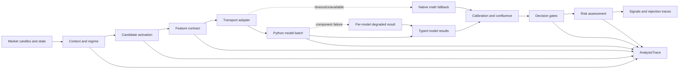

# Mimir Analysis Architecture

## Purpose

Mimir's analysis path is organized as a staged pipeline. Each stage has one responsibility, a typed boundary, an observable status, and an explicit degradation policy. The goal is to prevent model-specific details, fallback behavior, feature-order logic, and final trade gating from becoming coupled inside one large function.

## Target flow

## Stage ownership

| Stage | Owner | Input | Output | Failure policy |
|---|---|---|---|---|
| Configuration | `analysis_contracts.ts` + adaptive-weight loader | Runtime configuration and learned weights | Normalized weights | Use defaults and record source |
| Risk state | `risk_engine.ts` | Database state | Synchronized risk limits | Fail the run if the single source of truth cannot be synchronized |
| Market context | `regime_detector.ts` | Market breadth and indicators | Regime and strength | Preserve the last valid regime or fail closed |
| Candidate activation | `scanner_activation.ts` | Scan results and regime | Activated candidates | Filter disabled setup types; record counts |
| Feature contract | `feature_engine.ts` | Candles, snapshot, market state | `FeatureVector` | Skip incomplete candidates; never fabricate ranker vectors |
| Transport adapter | `inference_payload.ts` | Internal candidate context | `BatchInferenceCandidate[]` | Centralize OHLCV encoding and 32-feature projection |
| Model batch | `ai_client.ts` and FastAPI | Typed batch candidates | `BatchResult` map | Circuit breaker and native fallback |
| Calibration/confluence | Python ranker/confluence plus Node fallback | Component scores | Confidence and calibrated probability | Use explicit confluence fallback and expose source |
| Decision gates | `signal_generator.ts` | Candidate context and model result | Accepted/rejected decision trace | Reject on invalid gate or stale required features |
| Risk assessment | `risk_engine.ts` | Accepted setup and calibrated probability | Position size and warnings | Reject when limits or execution conditions fail |

## Shared contracts

`analysis_contracts.ts` defines `AnalysisTrace`, `AnalysisStageRecord`, `AnalysisEnvelope<T>`, and the stage-recording helpers. A trace has a unique ID, start time, ordered stage records, durations, source labels, reasons, candidate counts, and a list of degraded components.

`inference_payload.ts` owns the internal-to-Python boundary. It is the only place that converts `OHLCV[]` into the numerical matrix expected by the AI client and projects the full feature vector onto the ordered ranker contract. This prevents a second caller from accidentally changing candle-column order or ranker feature order.

## Fallback policy

Fallbacks are layered rather than global:

| Failure | Allowed fallback | Must not happen |
|---|---|---|
| Python service unavailable | Native math confidence and technical ranking | Treat a fallback result as a learned probability |
| Chronos unavailable | Chronos deterministic fallback forecast | Claim the forecast came from the pretrained checkpoint |
| FinBERT unavailable | Keyword-only or neutral sentiment | Treat neutral caused by outage as genuine neutral news |
| Ranker artifact missing | Null `P(target1 before stop)` and composite ranking | Fabricate a probability or silently pass the ranker gate |
| Confluence artifact missing | Weighted arithmetic blend | Report a trained regime model as active |
| PPO artifact missing | HOLD / zero adjustment | Inject an unvalidated policy into the main signal path |
| Required real-time feature stale | Mark ranker vector incomplete | Zero-fill and call the learned model anyway |

## Observability contract

Every completed pipeline returns `analysisTrace`. Accepted and rejected signal traces include the same `analysisTraceId`, making it possible to correlate a final decision with:

- the regime and candidate-activation stage;
- the exact feature-engineering and transport boundary;
- the AI health snapshot and ranking provider;
- whether inference returned Python results or native fallback results;
- decision-gate counts, risk rejections, and accepted signals.

The `/health` endpoint remains the component-level operational view. `AnalysisTrace` is the per-run decision view. The two views are intentionally separate: health describes service capability, while a trace describes what actually happened for one scan.

## Migration guidance

The refactor is additive. Existing `PipelineResult` fields and signal payload names remain available for API compatibility. Consumers that do not understand `analysisTrace` can ignore the new field. New consumers should prefer the trace rather than inferring model status from `aiMode` or `rankingProvider` alone.

The next architectural step is to move confluence/calibration into a typed `ModelResult` envelope and to persist the trace ID, model hashes, feature-manifest hash, and fallback sources alongside each signal outcome. That requires a database migration and should be implemented before continuous retraining is enabled.
