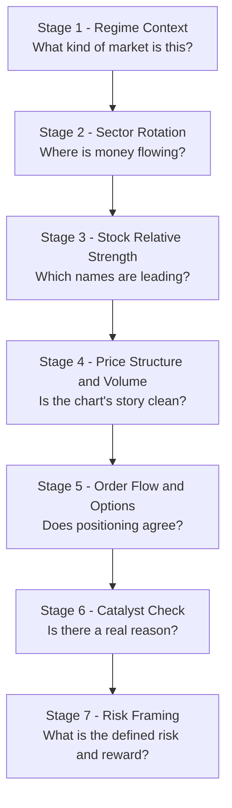
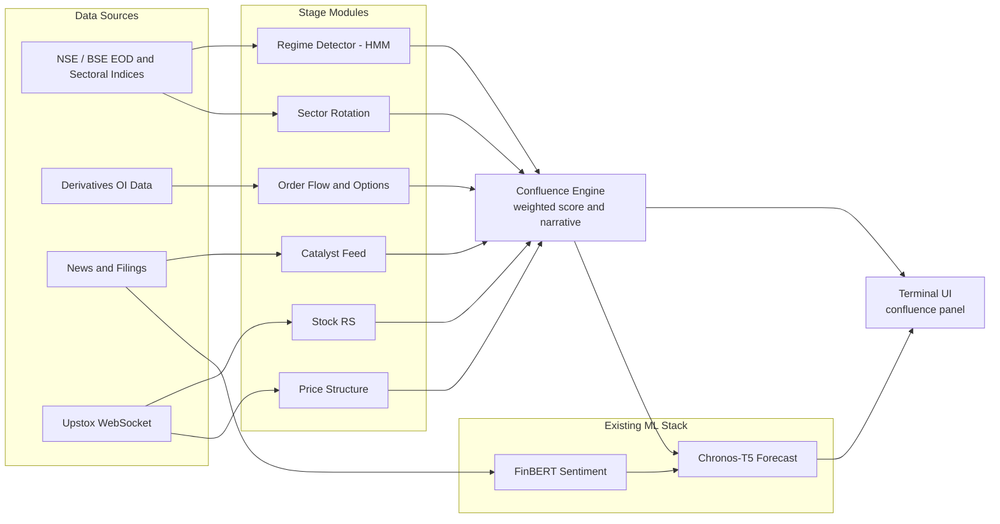

# The Trader's Funnel: A Confluence-Based Reasoning Layer for Mimir

## Purpose

Most retail/algo systems go one of two ways: pure bottom-up (feed raw OHLCV and indicators into a model and hope it learns structure implicitly) or pure top-down manual (a human runs a checklist in their head). What experienced discretionary traders actually do is run a top-down funnel — context, then confirmation, then catalyst, then risk — every single time, fast enough that it feels like intuition. The tell is that they can always narrate the "why" afterward.

Mimir already has strong bottom-up ML: Chronos-T5 forecasting, HMM regime detection, FinBERT sentiment gating, and an in-progress order-flow/F&O feature set. What it doesn't have yet is the explicit top-down structure or the narrative layer. This document proposes building that funnel as a mostly non-ML **Confluence Engine** that sits alongside the existing stack rather than replacing it. Three things make this worth prioritizing:

1. It's cheap. Almost everything below is pandas/numpy, not GPU-bound — it doesn't compete with Chronos-T5/FinBERT for your RTX 3050's budget.
2. It produces a human-readable narrative alongside a score, which is arguably more useful in a trading terminal UI than raw SHAP attributions, and gives you a second, independent way to explain a signal.
3. It forces a walk-forward validation harness into existence as a dependency, not a nice-to-have — you'll need one to honestly tune stage weights anyway.

Each stage below is scoped tightly enough to become its own implementation prompt.

## The Decision Funnel



### Stage 1 — Regime Context

**Trader question:** *Am I in a market that rewards trend-following, or one that punishes it?*

- Nifty 50 position relative to 20/50/200 DMA, and the slope of the 50 DMA itself (rising / flat / falling)
- India VIX level plus 5-day rate of change — don't hardcode absolute thresholds (e.g. "VIX > 25 = stress"); derive regime cutoffs from Mimir's own historical VIX distribution since the "normal" band drifts over years
- Market breadth: % of your tracked universe above its 50 DMA and 200 DMA. A rising index with deteriorating breadth (narrow leadership) is a classic late-stage warning that price alone won't show
- Global cue proxy: GIFT Nifty overnight change, Dow/S&P futures, Brent crude, DXY, US 10Y yield — sets the opening tone

**Maps to:** your existing HMM regime detector. Recommend enriching its observation vector with breadth and a VIX-regime feature rather than standing up a second classifier.

### Stage 2 — Sector Rotation

**Trader question:** *Which sectors are institutional flows favoring right now?*

Use a Relative Rotation Graph (RRG) style approach — this is the standard framework professional sector-rotation traders use, and it's fully computable from index OHLC:

- For each NSE sectoral index (Bank, IT, Auto, Pharma, FMCG, Metal, Realty, PSU Bank, Energy...), compute a normalized RS-Ratio = smoothed(sector index ÷ Nifty 50)
- Compute RS-Momentum = rate of change of RS-Ratio over a short window (5–10 sessions)
- Classify into four quadrants: **Leading** (ratio and momentum both strong), **Weakening** (ratio strong, momentum fading), **Lagging** (both weak), **Improving** (ratio weak, momentum turning up)
- Output a daily-refreshed sector rank + quadrant label, attached to every stock as a categorical feature

### Stage 3 — Stock Relative Strength

**Trader question:** *Within the strong sectors, which specific names are leading?*

- A recency-weighted momentum percentile rank across your full universe, in the general style popularized by IBD's RS Rating — heavier weight on the most recent quarter, less on the trailing three. A reasonable starting split is roughly 40% most-recent-quarter / 20% each on the prior three, but treat these as tunable, not gospel — validate them, don't hardcode them
- Percentile-rank on a 1–99 scale (the convention traders already read intuitively, useful if you ever surface this number directly in the UI)
- Combine with Stage 2: a strong stock in a Lagging sector is a materially weaker setup than the same RS score in a Leading sector — the two stages should gate each other, not just average

### Stage 4 — Price Structure and Volume Confirmation

**Trader question:** *Is there a clean structural setup, and does volume confirm it?*

- **Volatility contraction:** rolling ATR or Bollinger Band width hitting a local N-day minimum flags a "coiling" base
- **Breakout confirmation:** close beyond the base's resistance edge *and* volume ≥ 1.5–2x the 20-day average. A breakout without volume expansion should be down-weighted or flagged unconfirmed, not treated the same as a confirmed one
- **Pullback quality:** in an existing uptrend, declining volume on a pullback is healthy (no supply); rising volume on a pullback is a distribution warning
- **Market structure:** detect swing pivots (a simple fractal — a bar whose high/low exceeds N bars on each side) and classify the sequence as higher-highs/higher-lows vs lower-highs/lower-lows
- **Volume Profile:** bucket traded volume by price over a lookback window to find the Point of Control and high-volume nodes — these behave as real support/resistance because a large share of participants have cost basis sitting there

This stage also outputs the literal price levels other stages need — most importantly, Stage 7's stop placement.

### Stage 5 — Order Flow and Options Positioning

**Trader question:** *Does positioning data — not just price — agree with the move?*

This is the most direct extension of the F&O and order-flow work already underway:

- **OI–price quadrant classification**, the standard four-box used constantly in Indian F&O commentary: Price↑/OI↑ = Long Buildup (fresh bullish), Price↑/OI↓ = Short Covering (bullish, less durable), Price↓/OI↑ = Short Buildup (fresh bearish), Price↓/OI↓ = Long Unwinding (bearish, less durable). Compute per-stock *and* for Nifty/Bank Nifty futures as a market-wide gauge
- **PCR (Put-Call Ratio) by OI**, read against the stock/index's *own* historical distribution rather than a fixed absolute threshold — "normal" PCR varies a lot by name. Extremes are a contrarian/exhaustion signal; the trend of PCR is a sentiment gauge
- **Max Pain**, recomputed daily, most informative in the final 2–3 sessions before expiry
- **OI walls** — strikes with disproportionate OI, which option writers have a real incentive to defend, function as psychological support/resistance
- **IV Rank/Percentile** — current IV against its own trailing-year range, useful as a gating input for FinBERT-driven event trades
- **Cumulative Volume Delta and absorption detection** — running aggressor buy-minus-sell volume, and flags where large opposing volume produces minimal price displacement (a classic large-participant-defending-a-level signature)

### Stage 6 — Catalyst Check

**Trader question:** *Is there an identifiable reason for this, and is institutional money actually involved?*

- **FII/DII net flow** — daily figure plus rolling 5-day and 20-day sums. A single day's number is noisy; the multi-day trend is the actual signal. This is the timing consideration already flagged for Mimir
- **Bulk/block deal data** (published by NSE/BSE) — a stock appearing in bulk deals from identifiable institutional accounts, especially stacked with bullish reads from the earlier stages, is a strong smart-money footprint
- **Promoter pledge/shareholding changes** from SAST disclosures — rising pledge or promoter selling is a red flag worth surfacing even when price action looks clean
- **Earnings/event calendar proximity** — flag names entering their results window and tag signals generated inside it differently; IV typically rises into earnings and a normal-day signal shouldn't be scored the same way
- **Catalyst-tagged sentiment** — rather than blanket FinBERT sentiment on all news, weight sentiment more when it's attached to an identifiable catalyst (results, order win, regulatory action, promoter action). Catalyst-tagged sentiment is far less noisy than undifferentiated news flow

### Stage 7 — Risk Framing

**Trader question:** *Where am I wrong, and is the reward worth that risk?*

This is a position-sizing/risk layer, not a signal-generation layer — it should sit downstream of the Confluence score, not inside it.

- ATR-based stop distance rather than a fixed percentage, anchored to the Stage 4 structure levels (e.g., just beyond the base's low, sized in ATR multiples)
- R-multiple framing for every setup: risk (distance to invalidation) vs. reward (distance to the next structural level or measured move) — not a raw price target
- Position sizing as a function of both confluence score and volatility, so higher-conviction, lower-volatility setups naturally get more size

## The Confluence Engine

The most important architectural move here isn't any single stage — it's building a separate module that sits between the stage outputs and the ML stack:

1. **Evaluate each stage independently**, emitting a verdict (bullish / neutral / bearish) plus a confidence for that stage alone.
2. **Combine into a composite score.** A weighted sum is a fine starting point; the weights should eventually be walk-forward validated, not hand-picked once and frozen.
3. **Generate a template-driven narrative** from whichever stages actually fired — something like: *"Nifty in an uptrend, VIX calm. Banking sector in the Leading quadrant, RS-momentum improving. Stock ranks in the 87th percentile for relative strength. Broke an 8-week base on 2.3x average volume. Futures showing Long Buildup, PCR falling. FIIs net buyers for 6 sessions."* Because this is assembled from the actual stage outputs rather than free-text generation, it's fully traceable back to real numbers.
4. **Route the score and narrative two places:** as a structured feature into Chronos-T5/HMM (so the forecast is conditioned on the confluence read), and directly into the UI as a checklist panel — a natural fit for the existing dark-terminal aesthetic: monospace, green/red/amber ticks per stage, no decorative chrome.

Why not just rely on SHAP over the existing ML stack? SHAP tells you which inputs moved the model's output in its own internal feature space — genuinely useful, but not the same as a causal trading story. Because the Confluence Engine's logic is hand-specified rather than learned, its narrative is exactly as legible as the trader mental model it's copying. Worth keeping both: comparing what the Confluence Engine says against what SHAP says the ML layer is actually weighting tells you whether the ML stack has learned anything resembling the funnel, or is quietly ignoring it in favor of something else.

## Architecture Integration



| Stage | Concrete Signal(s) | Data Needed | Maps To (Mimir) | Effort |
|---|---|---|---|---|
| 1. Regime | DMA slope, VIX regime, breadth, global cues | Nifty/VIX OHLC, universe OHLC | Extends existing HMM regime detector | Low |
| 2. Sector Rotation | RRG-style RS-Ratio / RS-Momentum per sector | NSE sectoral index OHLC | New module | Low–Medium |
| 3. Stock RS | Recency-weighted momentum percentile | Universe OHLC | New module | Low |
| 4. Price Structure | Base detection, breakout+volume, swing HH/HL, volume profile | OHLCV | New module | Medium |
| 5. Order Flow / Options | OI quadrant, PCR, Max Pain, OI walls, IV rank, CVD | Derivatives OI/OHLC, book depth | Extends existing F&O / order-flow work | Medium |
| 6. Catalyst | FII/DII flow, bulk/block deals, pledge changes, earnings calendar | NSE/BSE EOD reports, SAST filings | Extends existing FinBERT sentiment gating | Medium (new scrapers) |
| 7. Risk Framing | ATR stop, R-multiple, vol-aware sizing | Derived from Stage 4 | New downstream module | Low |
| Confluence Engine | Combine stages, weighted score, narrative template | Outputs of Stages 1–6 | New module — connective tissue | Medium |

## Data Sources for Indian Markets

- **NSE/BSE bhavcopy** — free daily OHLCV plus delivery %, a solid backfill source
- **NSE sectoral indices** — needed for Stage 2
- **India VIX** — published daily by NSE
- **Derivatives OI data** — needed for Stage 5; check whether the Upstox feed already carries OI, or whether NSE's F&O bhavcopy is needed for backfill/verification. Broker APIs change what they expose over time, so confirm current field coverage against Upstox's own docs before building rather than assuming
- **Bulk/block deals and FII/DII provisional data** — published on the NSE/BSE websites, typically not part of a broker's live-feed API. Likely needs a small scheduled scraper into Postgres, separate from the WebSocket pipeline

## Phased Rollout

Given the RTX 3050 is already carrying Chronos-T5, FinBERT, and HMM inference, it matters that this entire layer is deliberately CPU-bound.

1. **Phase 1 — no ML, pure computation.** Stages 1–4 (regime, sector rotation, stock RS, price structure). All pandas/numpy. Ships fastest, and is useful as a standalone screener even before the Confluence Engine glue exists.
2. **Phase 2 — Stage 5 extensions** (OI quadrant, PCR, Max Pain, OI walls) on top of the existing F&O work, plus Stage 6 catalyst scrapers (FII/DII, bulk/block deals).
3. **Phase 3 — Confluence Engine glue.** Combine stage verdicts, weighted scoring, narrative templating, wire into the UI as an explainability panel.
4. **Phase 4 — feed the confluence score into Chronos-T5/HMM as an input feature**, then walk-forward validate confluence-only vs. ML-only vs. combined. This is the natural moment to build the walk-forward harness that's already flagged as missing — you'll need it anyway to honestly tune Stage 3's weighting and the Confluence Engine's stage weights, so it stops being a separate to-do and becomes a dependency of this feature.
5. **Phase 5 — Stage 7 risk framing / position sizing**, once the upstream score is trusted enough to size real positions off it.

## Where This Can Go Wrong

- Hand-picked stage weights are exactly as overfit-prone as any other free parameter — walk-forward validate them rather than eyeballing on the same period you're evaluating on.
- **Regime dependence:** a confluence recipe tuned mostly on a trending market can misfire badly in a prolonged chop. Track performance conditioned on the Stage 1 regime label, not just in aggregate.
- **Survivorship/lookback bias** in the Stage 3 universe ranking — make sure delisted or renamed stocks aren't silently dropped from historical universe construction.
- This formalizes common trader heuristics; it doesn't reproduce any individual trader's actual edge. Real discretionary edge often comes from context this can't see — broker order flow, unlisted information, direct promoter conversations. Treat this as raising the floor, not claiming to reach the ceiling.
- None of this is investment advice for any particular stock. It's a feature-engineering methodology for a system you're building and testing yourself, and it should be judged the same way any other Mimir component is: by walk-forward performance, not by how plausible the narrative sounds.

## Suggested Starting Prompt (Phase 1)

```
Implement two new modules: `regime_context` and `sector_rotation`.

Scope:
- regime_context: compute Nifty 50 slope (20/50/200 DMA), India VIX level
  + 5-day rate of change, NSE universe breadth (% of stocks above 50/200 DMA).
  Output a regime label enum (e.g. TRENDING_UP, TRENDING_DOWN, CHOPPY_HIGH_VOL,
  CHOPPY_LOW_VOL). Derive VIX regime cutoffs from historical distribution,
  do not hardcode absolute thresholds.
- sector_rotation: compute RS-Ratio and RS-Momentum per NSE sectoral index
  vs Nifty 50, classify into Leading / Weakening / Lagging / Improving
  quadrants, output a ranked sector table refreshed daily.

Constraints:
- Do not modify the existing HMM regime detector — this is a parallel
  enrichment module for now, to be wired in later.
- Do not touch UI or styling — dark terminal, monospace, no new colors
  beyond the existing semantic green/red/amber.
- Pure pandas/numpy — no new ML dependencies, no GPU usage.
- Include unit tests with synthetic OHLC fixtures for the quadrant
  classification logic.
```
