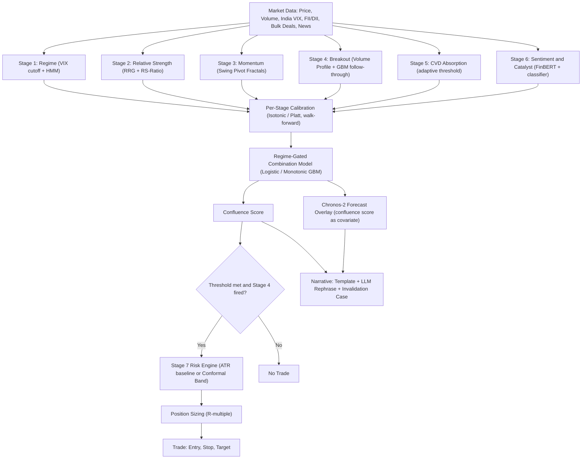

# Mimir Confluence Engine — Unified Strategy Specification
### Merging Rule-Based Trader Insight with the ML Enhancement Layer

**Document status:** Strategy & systems specification — an engineering document, not investment advice (see Section 15).
**Market:** Indian equities, Nifty / Bank Nifty universe — inferred from the FII/DII, bulk-deal, and India VIX references in the source material.
**Hardware constraint:** One RTX 3050 GPU, shared across every sequence model in the system.

---

### A note on what this is built from

The source material is a technical review of an existing rule-based system — it names seven stages, refers to a "Phase 1 prompt" that presumably specifies each stage's exact logic, and proposes ML enhancements without repeating what the base stages already do. That underlying Phase 1–3 specification — exact thresholds, exact lookback windows — isn't part of what's available here.

What follows reconstructs the seven-stage architecture from everything the source material references directly, then builds the actual merge: trader-authored rules plus the ML layer, combined into one strategy with a concrete path from signal to position. Where a design choice fills a gap the source material doesn't specify — exact entry thresholds, target/exit logic — it's marked **[Proposed]**, so it's clear what's grounded in your material versus a reasonable default you should validate or override against your real Phase 1–3 build. Chronos-2 and Chronos-Bolt figures below were independently verified against Amazon's published documentation as of this writing.

---

## Table of Contents
1. [Executive Summary](#1-executive-summary)
2. [The Merge at a Glance](#2-the-merge-at-a-glance)
3. [Design Philosophy](#3-design-philosophy)
4. [System Architecture — Pipeline Overview](#4-system-architecture--pipeline-overview)
5. [Stage-by-Stage Specification](#5-stage-by-stage-specification)
6. [Calibration Layer](#6-calibration-layer)
7. [The Confluence Combination Engine](#7-the-confluence-combination-engine)
8. [From Confluence Score to Trade — The Profit Mechanism](#8-from-confluence-score-to-trade--the-profit-mechanism)
9. [Forecast Overlay — Chronos-2 Migration](#9-forecast-overlay--chronos-2-migration)
10. [Narrative & Explainability Layer](#10-narrative--explainability-layer)
11. [Validation Harness — Overfitting Control](#11-validation-harness--overfitting-control)
12. [Data Infrastructure & Point-in-Time Integrity](#12-data-infrastructure--point-in-time-integrity)
13. [Compute Budget](#13-compute-budget)
14. [Implementation Roadmap](#14-implementation-roadmap)
15. [Risk Factors & Honest Limitations](#15-risk-factors--honest-limitations)
16. [Recommended Next Step](#16-recommended-next-step)
17. [Glossary](#17-glossary)

---

## 1. Executive Summary

The Mimir Confluence Engine is a seven-stage equity strategy system. Stages 1–4 are rule-based technical detectors — regime, relative strength, momentum, breakout — that encode a trader's judgment directly and transparently. Stages 5–6 layer sentiment and order-flow reads on top. Stage 7 turns all of it into a position.

The core design decision this document makes explicit: **ML never replaces a rule's verdict — it only does three things: combine the six stage verdicts into one score, calibrate each stage's confidence so it means what it claims, and turn that score into a risk-sized position.** Everything a trader would recognize as "the analysis" — what counts as a breakout, what counts as absorption, what counts as a real catalyst — stays rule-based, cheap, and inspectable line by line. The ML layer sits entirely in the connective tissue between those rules, and runs on the CPU. The one GPU stays reserved for the three sequence models that actually need it: HMM (regime), FinBERT (sentiment), and the Chronos time-series forecaster.

That combination point — Section 7 — is where the "merge" the rest of this document works toward actually happens: six independently-reasoned trader verdicts become one number, and that number is what a position is sized against.

If you read nothing else, read Sections 7, 8, and 11. Section 7 is the merge itself. Section 8 is how it becomes a trade. Section 11 is what determines whether any of this is real, or just an artifact of testing too many parameters against the same historical data.

---

## 2. The Merge at a Glance

| Stage | Trader's Insight (Rule Logic) | ML / Technological Layer | What the Merge Actually Does |
|---|---|---|---|
| **1. Regime** | VIX-percentile cutoffs from the historical distribution define the regime state | HMM statistical regime classifier runs in parallel | Already a hybrid today — ML cross-checks and smooths a human-defined threshold |
| **2. Relative Strength** | RRG quadrant classification (leading / weakening / lagging / improving) + RS-Ratio smoothing | RS percentile is reused as a feature inside the Stage 4 classifier | Rule output becomes ML input downstream — not touched in place |
| **3. Momentum** | Swing pivot fractals, multi-day momentum | None proposed | Left alone — already cheap, transparent, and correct for what it detects |
| **4. Breakout** | Volume profile / base-tightness rule fires the breakout verdict | Gradient-boosted classifier scores P(follow-through) | ML multiplies confidence in a rule's verdict; the rule still decides yes/no |
| **5. CVD Absorption** | Large opposing volume + minimal price displacement heuristic | Rolling robust z-score or isolation forest replaces the fixed threshold | ML makes a static trigger point adaptive to recent conditions |
| **6. Sentiment & Catalyst** | FinBERT sentiment polarity; "weight more if catalyst-backed" rule | Lightweight classifier / NER tags catalyst type from headline text | ML fixes the weak link — catalyst identification — inside an existing rule |
| **7. Risk & Stops** | Flat ATR multiple; R-multiple risk framework | Regime-weighted conformal prediction band *(prototype)* | ML replaces one fixed parameter with an adaptive, coverage-guaranteed one |
| **Combination** | Hand-picked, frozen weighted sum *(current)* | Regime-gated logistic regression / monotonic GBM over calibrated stage outputs | **The central merge point** — six trader-authored verdicts become one score |
| **Calibration** | — | Isotonic regression / Platt scaling, fit walk-forward, per stage | Pure ML — makes a rule-stage's confidence number mean what it claims |
| **Forecast** | Confluence score as an input feature *(Phase 4 plan)* | Chronos-2, covariate-informed | Extends the system from stage detection into path forecasting |
| **Narrative** | Template structure traceable to real numbers | LLM constrained to rephrasing only — never adds a fact | The trader's structure stays authoritative; the model can't introduce judgment |

Three stages (1, 6, and the combination/calibration layer) are where rule and model genuinely intertwine. Two stages (4, 5) keep the rule as the decision-maker and use ML purely as a confidence multiplier. One stage (3) is deliberately untouched. That asymmetry is intentional — see Section 3.

---

## 3. Design Philosophy

**ML multiplies confidence; it does not replace judgment.** Every ML component in this system either (a) scores how much to trust a rule that already fired, (b) corrects a confidence number so it's honest, or (c) turns a trusted score into a position size. None of them are handed the authority to invent a signal a rule wouldn't have raised on its own. This is a deliberate constraint, not a limitation of the tooling — a monotonic constraint in the combination model (Section 7) makes it structurally impossible for a bullish reading in one stage to be *reduced* by the model; it can only ever add confidence, never manufacture a contradiction the rules didn't support.

**The GPU is reserved, not shared out.** HMM, FinBERT, and the Chronos forecaster are the only components that need a GPU, and they already share one RTX 3050. Every new component this document proposes — the combination model, the calibration layer, the three narrow classifiers, the conformal risk engine — runs on the CPU. A dozen-feature logistic regression, an isotonic regression fit, a small gradient-boosted classifier, and a rolling z-score are all trivial CPU work. This isn't a corner cut for hardware reasons; it's the correct architecture regardless of hardware, because interpretability degrades the moment you reach for a bigger model than the problem needs.

**The trader stays in the loop, not just in the design.** The rule stages encode a trader's judgment once, at design time. The narrative layer (Section 10) is what keeps that trader in the loop at *execution* time — every signal comes with a stage-by-stage read-out and an auto-generated case for why the trade could be wrong. Nothing in this design requires unattended execution. The system is built to hand a trader a fully-reasoned recommendation, not to replace the decision.

**Every fitted parameter is a place the strategy can quietly overfit.** RRG lookback, RS split weights, ATR multiples, volume thresholds — these already exist as free parameters in Stages 1–4. The combination weights, calibration curves, and three new classifiers proposed here add more. That's not a reason not to build them — it's the reason Section 11 is not optional.

---

## 4. System Architecture — Pipeline Overview



Reading the pipeline left to right: raw market data feeds all six verdict-producing stages independently. Each stage's raw confidence gets calibrated before anything downstream sees it. The regime-gated combination model turns six calibrated verdicts into a single confluence score. That score either dies at the entry gate (no trade) or proceeds to Stage 7, where it's turned into an actual stop distance and position size. The forecast overlay and narrative layer are both downstream consumers of the same confluence score — they don't feed back into it.

---

## 5. Stage-by-Stage Specification

### Stage 1: Regime
**Rule logic (trader's insight):** Regime cutoffs derived from the historical India VIX distribution — a transparent, percentile-based classification of the current volatility state.
**ML enhancement:** An HMM statistical regime classifier runs alongside the VIX cutoff, already sharing GPU time with FinBERT and the Chronos forecaster.
**Output:** A single regime label (e.g. trending-low-vol, trending-high-vol, choppy) with an associated confidence.
**The merge:** This is the one stage that's already a hybrid in the current system — the HMM's statistical read either confirms or complicates the VIX-cutoff's rule-based read, and the combined label is what gates every downstream weight vector (Section 7).

### Stage 2: Relative Strength
**Rule logic:** RRG (Relative Rotation Graph) quadrant classification — leading, weakening, lagging, improving — with RS-Ratio smoothing and split weights across the calculation.
**ML enhancement:** None applied to the rule itself. Its output (RS percentile) is reused as one of the four input features to the Stage 4 follow-through classifier.
**Output:** Quadrant label + RS percentile + confidence.
**The merge:** A rule's output becomes another stage's ML input, rather than being modified in place — the rule stays exactly as a trader would read it.

### Stage 3: Momentum
**Rule logic:** Swing pivot fractals and multi-day momentum readings.
**ML enhancement:** None proposed in the source material, and none is warranted — this is already cheap, transparent, and correct for what it detects.
**Output:** Momentum verdict + confidence.
**The merge:** Deliberately absent. Not every stage needs augmenting; forcing an ML layer here would add a fitted parameter with no clear benefit.

### Stage 4: Breakout
**Rule logic:** Volume-profile and base-tightness detection fires the breakout verdict — a real base, a real volume signature, a real breakout, exactly as a trader would define one.
**ML enhancement:** A small gradient-boosted classifier predicts P(follow-through) from base tightness, breakout volume ratio, RS percentile (from Stage 2), and sector quadrant — trained on your own labeled historical breakouts.
**Output:** Binary breakout verdict (rule) × follow-through probability (ML), combined into a single confidence.
**The merge:** The rule still decides whether a breakout fired at all. The classifier only says how much to trust it once it has — it cannot manufacture a breakout the rule didn't see.

### Stage 5: CVD Absorption
**Rule logic:** The heuristic — large opposing volume with minimal price displacement signals absorption — using a fixed threshold.
**ML enhancement:** A rolling robust z-score, or a small isolation forest, over CVD magnitude, price displacement, and volume jointly, replacing the fixed threshold with one that adapts to the last N sessions.
**Output:** Absorption verdict + adaptive-threshold confidence.
**The merge:** The underlying concept — absorption — doesn't change. Only the trigger point becomes responsive to recent market conditions instead of a number picked once and frozen.

### Stage 6: Sentiment & Catalyst
**Rule logic:** FinBERT-scored sentiment polarity, weighted more heavily when attached to an identifiable catalyst (earnings, order win, regulatory action, promoter action).
**ML enhancement:** Catalyst identification is currently keyword-based — the acknowledged weak link. A lightweight classifier or NER pass tags catalyst type directly from headline text: one classification per headline, not per tick, so it stays nowhere near GPU-bound.
**Output:** Sentiment polarity × catalyst-weighted confidence.
**The merge:** FinBERT (already ML) supplies the sentiment read; the new classifier fixes catalyst identification, which is the part of the *rule* — "weight more if catalyst-backed" — that was previously unreliable.

### Stage 7: Risk & Stops
**Rule logic:** A flat ATR multiple sets stop distance; trades are evaluated in R-multiples against that stop.
**ML enhancement:** Regime-weighted conformal prediction — a distribution-free, coverage-guaranteed band around adverse excursion, conditioned on confluence score and regime, calibrated from past forecast errors using exponential time decay and regime-similarity weighting.
**Output:** Stop distance (ATR baseline, or conformal band once validated) feeding directly into position sizing.
**The merge:** Fully detailed in Section 8 — this stage is where the confluence score becomes an actual number of shares. **Flagged explicitly as a prototype, not a definite-ship:** markets aren't exchangeable in the strict sense the base conformal guarantee assumes, which is exactly why the regime-weighted variant exists — but it's still active research, not settled tooling. The ATR-multiple baseline should stay the default until the conformal band is walk-forward validated on your own series.

---

## 6. Calibration Layer

A stage reporting "0.8 confidence bullish" is a meaningless number unless it corresponds to something close to an 80% historical hit rate. There's no reason to assume it does by default — a rule's confidence score is usually a heuristic, not a calibrated probability. This layer checks, and fixes it if it's wrong.

**Method:** Isotonic regression (non-parametric, more data-hungry, no shape assumption) or Platt scaling (a fitted sigmoid, works with less data, assumes a roughly monotonic relationship) — per stage, fit walk-forward so the calibration itself never sees future data relative to the point it's applied.

**Why it has to happen before combination, not after:** the combination model in Section 7 is only as good as the inputs it's combining. Feeding it six raw, possibly-miscalibrated confidence scores means it's implicitly learning to correct for miscalibration *and* learning stage importance at the same time — conflating two different problems the calibration layer can solve separately and more reliably.

```python
# Illustrative — not a tested implementation
for stage in stages_1_to_6:
    raw_confidence = stage.compute_verdict_and_confidence(features)
    calibration_model = calibration_models[stage][current_regime]
    calibrated_prob = calibration_model.transform(raw_confidence)
    # calibration_model: isotonic regression or Platt scaling,
    # refit each walk-forward window using only data available as-of that window
```

Calibrating per regime as well as per stage is worth testing explicitly — a stage's confidence-to-hit-rate relationship may not be stable across a trending market versus a chop, which is the same concern that motivates gating the combination weights by regime in Section 7.

---

## 7. The Confluence Combination Engine

This is the piece the source material names as the actual unresolved problem, and it's the center of the whole merge: **how do six independently-reasoned, rule-and-ML stage verdicts become one number a position gets sized against?**

**Current state:** a hand-picked, frozen weighted sum. Workable as a starting point, but every one of those weights is a free parameter that's never been walk-forward validated — exactly as overfit-prone as any other untested parameter in the system.

**Proposed mechanism:** a small supervised model over the six stages' calibrated verdicts and confidences — roughly a dozen features — trained with the label being forward N-day return, or hit/miss against the R-multiple thesis.

- **Model choice:** logistic regression, where the coefficients literally *are* the stage weights and remain fully inspectable — or a shallow gradient-boosted model with a **monotonic constraint per stage**, so a more bullish Stage 5 reading can only push the confluence score up, never down. That's a structural constraint on the model, not an empirical hope that it behaves that way.
- **Regime gating:** since Stage 1 already outputs a regime label, fit a *separate* weight vector per regime rather than one global set. This directly answers the risk of a recipe tuned mostly on a trending market misfiring in a prolonged chop. It's still a lookup between a handful of small linear models — not a black box, and not GPU work.

```python
# Illustrative — not a tested implementation
feature_vector = concat(
    [stage.verdict, stage.calibrated_prob] for stage in stages_1_to_6
)  # ~12 features

regime = stage_1.regime_label
combination_model = combination_models[regime]  # separate weights per regime

confluence_score = combination_model.predict_proba(feature_vector)
# monotonic constraint: d(confluence_score) / d(stage_confidence) >= 0
# for every stage aligned with the candidate direction
```

**Training label options:**
- Forward N-day return (continuous) — better for a probability-style confluence score.
- Hit/miss on the R-multiple thesis (binary) — better if the eventual use is closer to a win-probability estimate feeding position sizing directly.

Both are defensible; which one to use should be decided by which one Section 11's validation harness shows generalizes better out-of-sample, not by intuition.

This is also, per the source material, **the single highest-leverage place to start** — it's cheap to prototype, doesn't touch the existing Phase 1–3 build, and every other ML component in this document either feeds it (calibration) or consumes its output (Stage 7, the forecast overlay, the narrative layer). See Section 16.

---

## 8. From Confluence Score to Trade — The Profit Mechanism

This section is the actual "one strategy" the earlier sections build toward — the concrete path from a confluence score to a sized position. Everything marked **[Proposed]** below fills a gap the source material doesn't specify; validate or override it against your own risk tolerance and Section 11's harness before trusting it with capital.

### 8.1 Entry
A candidate setup exists only when **Stage 4's breakout rule has actually fired** — the rule gates candidacy; the confluence score never generates a signal on its own. Once a candidate exists:

1. All six stages compute verdict + calibrated confidence.
2. The regime-gated combination model (Section 7) outputs a single confluence score.
3. **[Proposed]** Entry triggers when the confluence score crosses a threshold — for example, a calibrated probability of roughly 0.60–0.70 for a long entry. The exact number shouldn't be fixed by intuition; it should be walk-forward tuned per regime, the same way the combination weights are.

### 8.2 Position Sizing
Standard R-multiple framework: risk a fixed fraction of account equity per trade, where 1R = entry price − stop price.

```python
# Illustrative — not a tested implementation; risk_per_trade_pct is an example, not a recommendation
if confluence_score >= entry_threshold[regime] and stage_4.breakout_fired:
    stop_distance = (
        conformal_band(confluence_score, regime)
        if conformal_band.is_validated
        else atr_multiple * atr(instrument)          # baseline, always available
    )

    risk_amount = account_equity * risk_per_trade_pct  # e.g. 0.5%-1%, example only
    position_size = risk_amount / stop_distance

    entry_price = current_price
    stop_price = entry_price - stop_distance            # long example
```

**[Proposed]** Scaling position size further by the confluence score itself (higher confidence → larger size, within the risk cap) is a reasonable refinement — but it needs its own walk-forward validation. Without that check, it risks simply amplifying whatever the combination model is already overfit to, rather than adding real information.

### 8.3 Stop-Loss
Two tiers, matching Stage 7:
- **Baseline (default until validated):** flat ATR multiple.
- **Upgrade (prototype track):** regime-weighted conformal prediction band — a coverage-guaranteed distance around adverse excursion, conditioned on confluence score and regime. Keep this on the ATR baseline until it's been walk-forward validated on your own Nifty/Bank Nifty series; the guarantee it offers depends on an exchangeability assumption markets don't strictly satisfy.

### 8.4 Target & Exit — **[Proposed]**
Not specified in the source material. A default consistent with the R-multiple framework already in use:

- Partial exit (e.g. 50%) at 1R, to de-risk the position.
- Trail the remainder using the same stop mechanism (ATR or conformal band), recalculated each session.
- Full exit on any of: stop hit; Stage 1 regime flip against the position; confluence score decaying below a *lower* exit threshold than the entry threshold (hysteresis, to avoid whipsaw around a single cutoff); or the thesis-invalidation condition from the auto-generated counter-narrative (Section 10) being met.

### 8.5 Where the "profit" actually comes from
To be direct about it: nothing in this document guarantees the strategy is profitable. The mechanism above is the machinery that turns a confidence signal into a correctly-sized bet with a defined loss limit — that's necessary for an edge to compound into profit, but it isn't the edge itself. The edge, if it exists, lives in whether the six stages' verdicts genuinely predict forward returns better than chance, and whether the combination and calibration layers preserve that signal instead of overfitting to it. Section 11 is what actually answers that question — everything upstream of it is instrumentation.

---

## 9. Forecast Overlay — Chronos-2 Migration

The source material's Phase 4 plan feeds the confluence score into **Chronos-T5** as an input feature. Worth flagging clearly: Amazon has shipped two full generations past that specific checkpoint family, and the newer ones are a materially better fit for exactly this use case.

**Chronos-T5** (original) — T5 encoder-decoder, autoregressive decoding, fundamentally univariate. Feeding it the confluence score as a covariate means working against its architecture, not with it.

**Chronos-Bolt** (Nov 2024) — a patch-based variant using direct multi-step decoding instead of autoregressive generation. Verified against Amazon's published benchmarks: up to **250× faster** and **20× more memory-efficient** than original Chronos at the same size, while also being **5% more accurate**, not a speed-for-accuracy trade.

**Chronos-2** (Oct 2025) — goes further, with native zero-shot support for univariate, multivariate, *and* covariate-informed forecasting in one architecture, using in-context learning rather than task-specific retraining. It accepts both past-only covariates and known-future covariates. On tasks that include exogenous features specifically, it shows the largest gains over its predecessor, and independently verified: it wins **over 90%** of head-to-head comparisons against Chronos-Bolt. It's also efficient enough to run inference on CPU as well as GPU, which matters directly for a shared RTX 3050.

**Why this matters for Phase 4 specifically:** feeding the confluence score into Chronos-T5 means hacking an exogenous signal into a model not built to take one. Chronos-2's covariate-informed mode is designed for precisely this pattern — the confluence score becomes a first-class covariate rather than a workaround. Migrating also frees real GPU headroom before Phase 4 even lands, since Bolt/Chronos-2 are dramatically lighter than original Chronos at the same size.

**Caveat, stated plainly:** validate the switch walk-forward against your own India-specific series before trusting it in production. Amazon's benchmarks (fev-bench, GIFT-Eval, Chronos Benchmark II) are broad general-purpose time-series suites — not Nifty/Bank Nifty specific, and market microstructure isn't the domain they were built to prove out.

*Further reading:* Amazon Science's Chronos-2 announcement (amazon.science/blog/introducing-chronos-2-from-univariate-to-universal-forecasting) and the model card (huggingface.co/amazon/chronos-2).

---

## 10. Narrative & Explainability Layer

Two components, both deliberately constrained:

**Template-driven narrative.** Fully traceable to real numbers — every sentence in the trade write-up maps to an actual stage output, not a generated impression. This is what keeps the "trader's insight" side of the merge in control at execution time (Section 3).

**LLM rephrasing pass.** The LLM's only role is a strict rewrite of the same structured outputs into readable prose — it is never allowed to introduce a fact not present in the inputs. This is a hard constraint, not a style preference: an LLM given latitude to "add color" to a trade narrative is an LLM given latitude to quietly introduce a claim the stages never made.

**Auto-generated counter-narrative.** A short "what would invalidate this thesis" case, generated from the same structured inputs the main narrative uses — which stage would need to reverse, what regime shift would undercut it. This isn't cosmetic: it's what Section 8.4's exit logic checks against, and it's what keeps a human trader positioned to override the system rather than just receiving its output.

---

## 11. Validation Harness — Overfitting Control

Read this section as seriously as Section 7. Everything built above adds fitted parameters on top of what already exists — RRG lookback, RS split weights, ATR multiples, volume thresholds. The combination weights, calibration curves, and three narrow classifiers all add more. That makes the validation question *more* urgent than it was before this document, not less: some combination of knobs will look good on any single historical run by chance alone, once this many are being tuned jointly.

**Why sequential walk-forward alone isn't enough:** several stages use overlapping lookback windows — multi-day momentum in Stage 3, rolling ATR/Bollinger width in Stage 4, RS-Ratio smoothing in Stage 2 — which creates feature/label overlap across a naive fold boundary. A plain walk-forward split doesn't account for that overlap.

**Purged Cross-Validation** removes overlapping observations between train and test folds, with an optional temporal embargo buffer around the test set for extra leakage protection — built for exactly this failure mode.

**Combinatorial Purged Cross-Validation (CPCV)** goes further: it generates multiple resampled backtest paths from the same purged folds instead of trusting a single walk-forward run. It's shown to be superior at mitigating overfitting risk in recent financial-ML comparisons, though plain walk-forward remains the industry standard for a final, realistic trading simulation — the two aren't competitors, they answer different questions (CPCV: is this robust? Walk-forward: how would this actually have traded?).

**Probability of Backtest Overfitting (PBO) and Deflated Sharpe Ratio.** With this many stages and this many jointly-fitted parameters, a genuine PBO estimate or a deflated Sharpe correction stops being optional. Recent extensions to these methods also condition train/test windows on volatility or macro regime directly — which lines up with the regime-dependence concern already built into Section 7's gating.

**Sequencing matters:** the validation harness upgrade should happen alongside the combination-engine build (Section 7 / Phase A in the roadmap below), not after it. The moment regime-gated weights exist, they're a new source of overfitting risk — validating them with the old sequential-walk-forward-only approach would be validating a more overfit-prone system with a less rigorous method than before.

---

## 12. Data Infrastructure & Point-in-Time Integrity

**Point-in-time feature snapshotting** matters more now than it did before weight-learning and the Stage 6 classifier existed, because both depend on historical labels being correct *as of the date they were used*. FII/DII flow figures and bulk-deal data get revised after initial publication. Without a snapshot store, training silently uses restated numbers the strategy would never have actually seen in real time — a subtle, easy-to-miss form of look-ahead bias.

**Data inputs implied by the stage architecture:**
- OHLCV price/volume, at whatever granularity CVD (Stage 5) requires.
- India VIX (Stage 1).
- FII/DII flow data, point-in-time snapshotted (Stage 6 weighting, general regime context).
- Bulk/block deal data, point-in-time snapshotted (Stage 6 catalyst signal).
- News headlines with timestamps (Stage 6 sentiment + catalyst classification).
- Sector/industry classification (Stage 4's sector-quadrant feature, Stage 2's RRG).

**Snapshot store design principle:** every feature used in training should be retrievable "as it was known" on the date it's labeled for, not "as it is now." This is a data-engineering requirement, not an ML one — it has to exist before the weight-learning and Stage 6 classifier can be trusted at all, regardless of which model architecture sits on top of it.

---

## 13. Compute Budget

| Component | Status | Compute | Notes |
|---|---|---|---|
| HMM (regime) | Existing | GPU (shared) | Already deployed on the RTX 3050 |
| FinBERT (sentiment) | Existing | GPU (shared) | Already deployed on the RTX 3050 |
| Chronos-T5 → Chronos-2 | Existing → upgrade | GPU (shared, lighter after migration) | Migration frees headroom before Phase 4 |
| Calibration (isotonic / Platt) | New | CPU | Per-stage fit, trivial cost |
| Combination model (logistic / GBM) | New | CPU | ~12 features, trivial cost |
| Stage 4 follow-through classifier | New | CPU | Small gradient-boosted model |
| Stage 5 adaptive threshold | New | CPU | Rolling z-score or small isolation forest |
| Stage 6 catalyst classifier / NER | New | CPU | One pass per headline, not per tick |
| Stage 7 conformal risk bands | New (prototype) | CPU | Wraps an existing quantile forecaster |
| LLM narrative rephrasing | New | API call or small local model | Strict rephrasing only, bounded scope |

The pattern holds throughout: everything genuinely new is CPU-cheap. The only GPU-relevant change this document proposes is making the *existing* GPU workload lighter, not heavier.

---

## 14. Implementation Roadmap

| Phase | Scope | Touches Phases 1–3? | Priority |
|---|---|---|---|
| **Existing (presumed complete)** | Rule-based Stages 1–7, plus already-integrated HMM / FinBERT / Chronos-T5 | — | Baseline |
| **A — Regime-gated combination model** | Section 7: replaces the hand-picked weighted sum | No | **Highest leverage — start here** |
| **A′ — Validation harness upgrade** | Section 11: Purged CV / CPCV / PBO, run alongside Phase A | No | Pair with Phase A, not after it |
| **B — Calibration layer** | Section 6: isotonic/Platt scaling per stage, feeds Phase A | No | High — feeds directly into A |
| **C — Three narrow classifiers** | Stage 4 follow-through, Stage 5 adaptive threshold, Stage 6 catalyst tagging | No | Can run in parallel with A/B |
| **D — Conformal risk bands** | Stage 7 upgrade over the ATR baseline | No | Prototype track — explicitly not definite-ship |
| **E — Chronos-2 migration** | Section 9: replaces Chronos-T5 ahead of Phase 4 | Touches the existing forecast integration point | Validate walk-forward before trusting |
| **F — Narrative layer** | Section 10: LLM rephrasing pass + auto-generated invalidation case | No | Lowest technical risk, do last |

---

## 15. Risk Factors & Honest Limitations

This is a systems specification, not investment advice, and nothing in it is a guarantee of profitability — I'm not a financial advisor, and the actual viability of any of this depends entirely on the validation step in Section 11, which hasn't been run here.

Specific limitations worth stating plainly:

- **Multiple-testing overfitting risk is real and cumulative.** Every fitted parameter added by this document — combination weights, calibration curves, three classifiers — increases the chance that a good-looking backtest is an artifact of trying enough combinations, not a real edge. This is why Section 11 isn't optional.
- **Conformal prediction's guarantee is conditional.** The coverage guarantee behind Stage 7's proposed upgrade assumes a form of exchangeability that markets don't strictly satisfy. The regime-weighted variant exists specifically to soften that assumption, but it doesn't eliminate it — treat it as a prototype until proven otherwise on your own data.
- **Chronos-2's benchmarks aren't market-specific.** State-of-the-art results on fev-bench, GIFT-Eval, and Chronos Benchmark II say nothing directly about Nifty/Bank Nifty behavior. Validate before trusting.
- **This document doesn't model execution reality.** Slippage, liquidity constraints at your actual position sizes, and transaction costs aren't addressed here and would materially affect any real performance figure — none are estimated or implied above.
- **Backtested or simulated performance, even done rigorously, doesn't guarantee future results.** Regime shifts this system hasn't seen before are the scenario every part of this design is trying to prepare for, not a scenario it can rule out.

---

## 16. Recommended Next Step

Consistent with the source material's own assessment: the **regime-gated combination model (Phase A)** is the single highest-leverage place to start. It's cheap to prototype, doesn't touch the existing Phase 1–3 build, and every other component in this document either feeds it or consumes its output. Pair it from day one with the Purged CV / CPCV upgrade (Phase A′) rather than sequencing validation in later — the two are designed to be built together.

A natural follow-up from here would be an implementation prompt for Phase A specifically, written in the same style as your existing Phase 1 prompt — happy to draft that next if useful.

---

## 17. Glossary

| Term | Meaning |
|---|---|
| HMM | Hidden Markov Model — statistical model for detecting hidden market states (e.g. trending vs. choppy) from observed data |
| VIX | Volatility index; India VIX reflects expected near-term volatility on the Nifty |
| RRG | Relative Rotation Graph — plots relative strength and momentum to classify leading/weakening/lagging/improving quadrants |
| RS-Ratio | Relative strength of an instrument versus a benchmark, the core input to RRG |
| CVD | Cumulative Volume Delta — running total of buy-initiated minus sell-initiated volume |
| ATR | Average True Range — a volatility measure commonly used to size stop distances |
| R-multiple | A trade's profit or loss expressed as a multiple of its initial risk (1R = entry price − stop price) |
| FinBERT | A BERT-family language model fine-tuned for financial sentiment classification |
| NER | Named Entity Recognition — extracting structured entities (e.g. catalyst type) from free text |
| GBM | Gradient-Boosted Model — an ensemble of decision trees trained sequentially to correct prior errors |
| Isotonic regression | A non-parametric method for mapping raw scores to calibrated probabilities, assuming only monotonicity |
| Platt scaling | A parametric calibration method that fits a sigmoid to map raw scores to probabilities |
| Conformal prediction | A distribution-free method for producing prediction intervals with a guaranteed coverage rate |
| Purged Cross-Validation | Cross-validation that removes training observations overlapping with the test window, to prevent leakage |
| Embargo | A buffer period around a test set, purged from training, for extra leakage protection |
| CPCV | Combinatorial Purged Cross-Validation — generates multiple resampled backtest paths from purged folds |
| PBO | Probability of Backtest Overfitting — estimates the likelihood a strategy's backtest performance won't generalize |
| Deflated Sharpe Ratio | A Sharpe ratio correction accounting for the number of trials/parameters tested |
| Point-in-time data | Data retrievable exactly as it was known on a given historical date, before later revisions |
| FII / DII | Foreign / Domestic Institutional Investor flow data, published for Indian markets |
| Bulk deal | A large single-transaction trade in an Indian-listed security, publicly disclosed |
| Zero-shot forecasting | A model producing forecasts on data it wasn't specifically trained on, without fine-tuning |
| Covariate-informed forecasting | Forecasting that incorporates external input features (covariates) alongside the target series |
| Regime | A persistent market state (e.g. trending, choppy, high/low volatility) that conditions strategy behavior |
